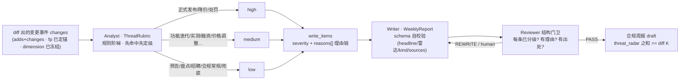

# Analyst 威胁分级 + Writer 模板化周报（Phase 5）

> 交付沿革：Phase 1 = 数据模型/持久化；Phase 2 = 采集层 Researchers；Phase 3 = Dedupe + 跨期 diff（把原始信号并成
> **变更事件**并定锚 fp）；Phase 4 = LangGraph 状态机把 P1–P3 串成周期流水线（此时 analyst/writer 还是"结构真、逻辑薄"的
> 薄节点）。Phase 5 = **把 analyst / writer 做实、图一条边不改**：
> - **Analyst**：给每条 diff 出的变更事件打 `high / medium / low` 威胁级 + **理由链**（哪条规则命中、哪些信号词、几源确认）；
> - **Writer**：把"已分级条目"组装成**结构一致、schema 自校验**的周报（`WeeklyReport`），只组装、绝不补充常识。
>
> 本文给规则阶梯 / 三条关键决策 / schema 合规 / 实测真值表，最后给局限。编排上下文见 [`docs/orchestrator.md`](orchestrator.md)。

---

## 1. 一张图看懂：从 diff 变更到可解释的分级周报



Analyst 输出进 `write_items`（JSON-safe dict：`severity` + `reasons[]`），Writer 把它组装成 `WeeklyReport` ——
整条链不调用 LLM、确定性可回归；`threat_radar` 各项之和必须等于 diff 出的 K（每条变更都进雷达，测试锁死）。

## 2. 为什么分级用"规则阶梯"不用纯 LLM（面试讲这三点）

1. **稳定性**：同一竞品每次"正式发布 / 降价"必须稳定判为同一级。LLM 打分会漂，规则不漂——
   确定性 → 同语料重跑，周报每条 severity 逐条不变（`tests/test_orchestration_graph.py` 用两条独立底库跑两次，
   连 severities 序列一起比对）。
2. **可解释**：每次分级都产出理由链 —— `规则[release_ga] 正式发布/GA 上线：… → 命中信号词：正式发布、GA →
   维度=feature；3 条独立来源 → 高威胁 → 建议本周进雷达头条`。不是黑盒分数，Reviewer 与人工都能审"为什么 high"。
3. **可审计、可定制、近零成本**：规则是显式数据对象（`analyst/rubric.py`），可逐条测试、可按行业替换，
   不埋在 prompt 里；全链无 LLM 调用 → 无 key 离线也能端到端跑（延续 fail-fast / mock 优先）。

诚实边界：这是**确定性信号分级器，不是语义理解器**。规则词面覆盖不到的"异词同威胁"（如"半价""砍单"未收录）会漏判——
按计划由 **LLM 补语义** 层兜底（真 provider 联调时在规则之后加一层），本期不假装已做（见 §8）。

## 3. 规则阶梯与定级表（`analyst/rubric.py` `default_rules`）

| 规则 id | 语义 | 限定维度 | 级 | 命中信号词（节选） | 什么时候给 |
|---|---|---|---|---|---|
| `release_ga` | 正式发布/GA | 不限 | **high** | 正式发布/正式上线/全面开放/公开发布 | 产品级变化已向用户交付，直接挤占客群 |
| `price_cut` | 降价/让利 | price | **high** | 降价/折扣/优惠/免费/下调 | 价格战直接冲击我方定价与留客 |
| `penalty` | 合规/监管风险 | compliance | **high** | 处罚/诉讼/监管/违规/整改/罚款/泄露 | 触碰红线，可能牵动行业口径 |
| `roadmap_preview` | 预告/路线图 | 不限 | **low** | 预告/即将/预计/路线图/计划于/下月/将于 | 未上线 → 进观察，不报即时威胁 |
| `third_party_review` | 第三方实测/评测 | 不限 | **medium** | 实测/评测/测评/上手体验 | 第三方放大竞品功能认知 |
| `funding_move` | 资本/战略动作 | market | **medium** | 融资/收购/投资/上市/出海 | 竞品将加大投入的先行信号 |
| `market_pan` | 第三方行业盘点 | market | **low** | 盘点/榜单/白皮书/趋势/象限/行业报告 | 观点内容，非竞品自身动作 |
| `org_hiring` | 招聘/内容运营 | org | **low** | 招聘/招募/入职/实习/开放职位 | 低威胁信号 |
| `price_other` | 商务条款常规调整 | price | **medium** | 涨价/调价/收费/订阅/定价/套餐 | 结构性价格调整（非让利） |
| `feature_update` | 功能/产品迭代 | feature | **medium** | （维度兜底） | 常规迭代基线 |
| `org_other` | 组织/战略动作 | org | **medium** | （维度兜底） | 非纯招聘/内容的组织动作 |
| `market_other` | 市场/渠道动作 | market | **medium** | （维度兜底） | 市场渠道层面动作 |
| `compliance_other` | 合规/舆情常规 | compliance | **low** | （维度兜底） | 未命中红线信号 |
| `default_low` | 兜底 | 不限 | **low** | — | 其余一律按低（必有兜底，杜绝漏分级） |

匹配方式：title+summary 经 `normalize_title`（NFKC→小写→去空白标点）后做**信号词子串匹配**，与指纹同一套书写归一。

## 4. 三条关键决策（面试常问的 why）

1. **为什么"先命中先定级"，且定性信号规则必须排在维度兜底之前？**
   阶梯从上往下第一条命中的规则定级。若把 `feature_update`（feature 兜底 medium）放在 `roadmap_preview`（low）前面，
   一条 feature 的"预告"会先被兜底抢成 medium —— 预告被误报成即时威胁。所以顺序铁律：**跨维度/低置信的定性信号规则
   （预告/实测/盘点/招聘）必须先于各维度兜底**（`test_default_rule_order_signal_before_catchall` 锁死），
   红线级规则（发布/降价/处罚）整体最前。
2. **为什么 Analyst 只读 dimension、绝不改维度？**
   `dimension` 已在 Phase 3 **混进 fp 并定锚**（fp = 去重 + 跨期 diff 的"认人"键）。Phase 5 若再分类改维度，
   同一件事会被 diff 成"消失 + 新增"两条**假情报**。所以 Analyst 只填 `severity` + 理由，`fp/dimension/kind` 原样进周报
   （`test_grade_never_rewrites_dimension_fp_kind` 锁死）。
3. **为什么 Writer 走 pydantic 自校验（fail-fast）、只组装不发挥？**
   "内容由谁写"是编造入口的边界：Writer 的每条 title/summary/evidence 都**逐字来自已验证 Event**，不做自由发挥；
   `WeeklyReport` 模型在组装时**重算并核对** headline 与条数、kind 分布与 diff sections、威胁雷达 ——
   结构不整的周报直接 raise，**发不出去**（`tests/test_writer_report.py` 逐条锁死）。

## 5. Writer：`WeeklyReport` schema 合规（`writer/report.py`）

| 校验（`_enforce_structural_consistency` 模型层强制） | 不一致后果 |
|---|---|
| `headline_count == len(items)` | `ValueError`（口径撒谎即拒绝） |
| items 的 `kind`(add/change) 计数 == `sections{adds,changes}` | `ValueError`（与 diff 对不上即拒绝） |
| 每条 `ReportItem`：`severity` 非空 ∈ high/medium/low、`reasons≥1`、`evidence_urls≥1`、title≥1 | `ValidationError`（缺分级/无理由/无出处即拒绝） |
| `threat_radar` = 按 items 的 severity **重算**（不信任调用方手填） | 手填错也会被纠正为真值 |
| `sources` = 全部条目 evidence_urls 的**排序并集** | 可溯源清单，确定性排序 |

## 6. 实测真值：fixtures 校准表（数字来自跑通断言，非编造）

跑 `demo_two_weeks()`（或 `tests/test_orchestration_graph.py::test_w35_threat_radar_sums_to_diff_and_every_item_graded`），
W35（对上期 W34 的 diff）每个变更事件的分级实测：

| 竞品 | 变更事件 | 维度 | 分级 | 规则 | 出处 |
|---|---|---|---|---|---|
| crm_alpha | Alpha CRM v12.0 正式发布：智能跟进助手 GA | feature | **high** | `release_ga` | 官网博客+rss+媒体 **3 源并入 1 条** |
| crm_alpha | 实测 Alpha CRM 跟进助手：自动化与人工兜底 | feature | **medium** | `third_party_review` | 单源（第三方评测） |
| crm_alpha | 预告：v12.1 移动端日历与待办同步 | feature | **low** | `roadmap_preview` | 单源 |
| bi_beta | 图表库 3.0 + 移动端适配正式发布 | feature | **high** | `release_ga` | 官网+媒体 **2 源并入 1 条** |
| bi_beta | 2026 商业智能工具盘点 | market | **low** | `market_pan` | 单源（行业盘点非自身动作） |
| bi_beta | 预告：目录级与行级权限管控下月开放 | feature | **low** | `roadmap_preview` | 单源 |
| bi_beta | 更新：看板分享新增链接权限与过期时间 | feature | **medium** | `feature_update` | 单源 |

威胁雷达（draft.threat_radar）实测与 diff K 严格自洽：

| 竞品 | W35 diff K | radar high | radar medium | radar low | 和 |
|---|---|---|---|---|---|
| crm_alpha | 3 | 1 | 1 | 1 | **= 3** |
| bi_beta | 4 | 1 | 1 | 2 | **= 4** |

（headline_count == K == items 条数；每条带 reasons≥1 与 evidence_urls；周报 `sources` = 本期出处并集，crm/bi W35 均为 5 个去重 URL。）

## 7. 运行与验证

```bash
uv sync && uv run pytest -q            # 全绿（Phase 5 = 110；P5 新增 analyst 15 + writer 11 + 编排补 3）
uv run pytest tests/test_analyst_rubric.py -q   # 分级：fixtures 校准 / 顺序铁律 / 理由链 / 不改维度
uv run pytest tests/test_writer_report.py -q    # 周报：只组装不发挥 / schema fail-fast / 雷达重算 / 空周报合法
uv run python -c "from orchestration import demo_two_weeks; demo_two_weeks()"
# 输出含 threat_radar：crm W35 {high1,med1,low1} · bi W35 {high1,med1,low2}，与 diff K 自洽
```

## 8. 局限（诚实口径）

- **规则词面漏判**：确定性信号词覆盖不到"异词同威胁"（如"半价""打骨折""停摆"未收词）会漏 → 既定路线是
  **LLM 补语义**层在规则之后兜底，本期不接、不假装。
- **不跨竞品横向对比**：本期分级是"单竞品单事件"口径；"crm 的降价 vs 我方价格带"这类**横向威胁对比 / 功能矩阵**仍未做。
- **Writer 不做正文叙述**：只输出结构化条目 + 雷达 + 出处清单；"自然语言周报正文/摘要生成"需要 LLM，且引入编造风险，后置。
- **Reviewer 仍是结构门卫**（每条必带出处/标题/维度 + P5 新增"已分级、带理由"）：它**不证明理由真实支撑结论**
  ——原文 grounding / 矛盾检测 / 合规评审是 Phase 6，别把 P5 说成已审稿。
- **severity 是确定性口径**，不是贝叶斯风险概率；"该不该动作"只给出提示词，最终判断留给人工/后续管线。

---

_更新日志_：2026-09-03 建（Phase 5 交付：Analyst rubric 分级 + Writer WeeklyReport schema 合规，110 测试全绿）。
