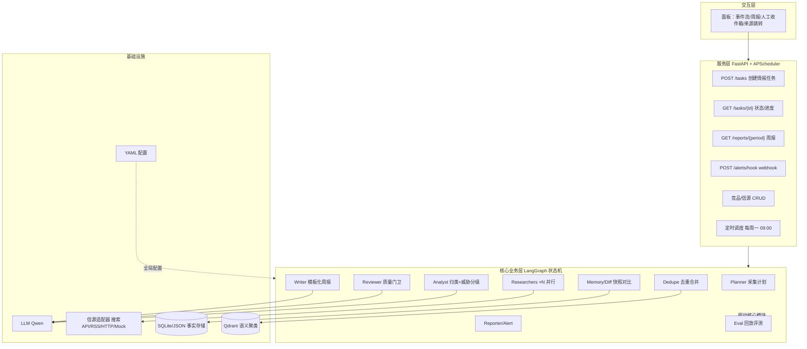
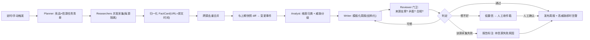

# 架构与骨架现状（architecture）

> 交付沿革：Phase 0 = 最小服务骨架 + Mock 底座；Phase 1 = 数据模型 + JSON/SQLite 持久化 + mock 语料切期；
> Phase 2 = 采集层 Researchers（并发采 3 类信源 → 归一化 FactCard，单源失败隔离）；
> Phase 3 = Dedupe 去重合并 + Memory/Diff 跨期 diff（FactCards → Events → 与上期快照比 → 变更事件 + 写档）；
> Phase 4 = LangGraph 编排状态机把 P1–P3 串成周期流水线（Planner→Researchers→Dedupe/Diff→Analyst→Writer→Reviewer，全 mock）；
> Phase 5 = 把 analyst（威胁分级 rubric high/medium/low + 理由链）与 writer（WeeklyReport schema 强制合规）做实，图一条边不改。
> 本文先落两张与设计稿一致的 Mermaid（见 `README2.md` §4.1/§4.2），再给"今天真实能跑的部分 / 未来挂载点"对照，
> 避免 README 只画将来、落地只有壳。数据模型细节见 [`docs/schema.md`](schema.md)，采集层细节见 [`docs/collectors.md`](collectors.md)，
> 去重与跨期 diff 细节见 [`docs/memory.md`](memory.md)，编排状态机细节见 [`docs/orchestrator.md`](orchestrator.md)，
> Analyst 分级 + Writer 周报细节见 [`docs/analyst_writer.md`](analyst_writer.md)。

---

## 1. 系统分层架构（目标，同设计稿 §4.1）



## 2. 主流程（目标，同设计稿 §4.2）



---

## 3. 落地现状对照表（截至 Phase 5：哪些"今天就能跑"，哪些是占位）

| 层 | 设计稿节点 | Phase 0 状态 | 落地位置 |
|---|---|---|---|
| 服务层 | FastAPI | ✅ `/health` + `/` 冒烟 | `app/main.py` |
| 服务层 | 任务/报告/告警 API | ⬜ Phase 7 routers | `app/routers/`（未建） |
| 服务层 | APScheduler 定时 | ⬜ Phase 7 | `config/config.yaml schedule`（占位） |
| 基础设施 | 配置 YAML | ✅ fail-fast 强类型 | `config/config.yaml` + `config/settings.py` |
| 基础设施 | LLM 抽象 | ✅ Mock 离线默认 | `llm/base.py` `mock_provider.py`；dashscope 壳未接 key（`dashscope_provider.py` raise） |
| 基础设施 | 信源适配器 | ✅ 抽象 + MockSource | `sources/base.py` + `sources/mock.py`；真实 HTTP/RSS adapter 仍占位（无 key 离线优先） |
| 基础设施 | Mock 数据 | ✅ 2 竞品 × 3 信源 × 两周 | `fixtures/sources/{crm_alpha,bi_beta}.json`（W34/W35 两期可切） |
| 基础设施 | SQLite/JSON 事实存储 | ✅ Phase 1 json 默认 / sqlite 可切，幂等覆盖 | `memory/{schemas,fingerprint,store,corpus,diff}.py`；根 `data/memory/` |
| 基础设施 | 核心数据对象 | ✅ FactCard/Event/Snapshot schema 定全（Event 实例 Phase 3 已产出） | `memory/schemas.py` + `docs/schema.md` |
| 基础设施 | Qdrant 语义聚类 | ⬜ 后置占位（语义近并仍未做，走确定性规则） | `config vector_db`（占位） |
| 核心业务层 | Researchers 并发采集 | ✅ Phase 2 collectors | `collectors/{schemas,normalize,worker,factory,orchestrator}.py` + `docs/collectors.md` |
| 核心业务层 | Dedupe 去重合并 | ✅ Phase 3 规则分类 + 版本锚/近原文聚类 | `dedupe/{classify,merge,__init__}.py` + `docs/memory.md` |
| 核心业务层 | Memory/Diff 跨期 diff | ✅ Phase 3 fp 认人 + digest 认内容 → add/change/remove/unchanged | `memory/diff.py`（build_snapshot/diff_event_sets/mark_removed）+ `docs/memory.md` |
| 核心业务层 | Analyst 威胁分级 | ✅ Phase 5 规则阶梯 high/medium/low + 理由链（确定性/可解释/只读维度不改 fp） | `analyst/{rubric,classifier}.py` + `docs/analyst_writer.md` |
| 核心业务层 | Writer 模板化周报 | ✅ Phase 5 WeeklyReport schema 自校验（headline/雷达/kind/sources；只组装不发挥） | `writer/{report,service}.py` + `docs/analyst_writer.md` |
| 核心业务层 | Reviewer 质量门卫 | 🟡 结构性门卫（每条必带出处/标题/维度 + P5 已分级带理由）→ P6 语义 grounding/矛盾/合规 | `orchestration/nodes.py`（reviewer_node）+ `docs/orchestrator.md` |
| 核心业务层 | Reporter/Alert / Eval | ⬜ 占位 | `orchestration/reporter`（占位包，P7）；`eval/harness.py`（占位类，P8） |
| 核心业务层 | LangGraph 状态机 | ✅ Phase 4–5（analyst/writer 做实，图一条边不改） | `orchestration/{state,planner,nodes,graph,pipeline}.py` + `docs/orchestrator.md` |

> 图里 P1–P8 的灰块是**目标态**；上表第二列标了它们此刻对应哪个 Phase。交付口径：
> Phase 1 交付 = 三类对象 schema 定全、JSON/SQLite 可存可取（幂等覆盖）、mock 语料可切 W34/W35 两期快照
> ——给 Phase 3 diff 留档的地基。
> Phase 2 交付 = **采集层**：每源一个 CollectorWorker 并发采（asyncio+信号量限流）、RawItem→FactCard 唯一归一化入口、
> 单源失败隔离进 failures 清单不中断全局、trace 计数链第一节（fetched→cards→failed）。
> Phase 3 交付 = **去重 + 跨期 diff**：确定性维度分类（fp 定锚前置）+ 版本锚/近原文聚类（Evidence 聚合）
> + 上期快照 vs 本期事件 diff（add/change/unchanged + 显式 remove，Snapshot 增 event_digests 判变更）。
> Phase 4 交付 = **LangGraph 编排状态机**：planner / researchers / dedupe_diff 是真节点（复用 P1–P3 已测库），
> analyst / writer / reviewer 以薄节点落地（结构真、逻辑留给 P5/P6），共享可序列化 State + checkpoint + 门卫条件边，
> 全 mock 下 81 测试全绿（编排 14 条）——一条命令出「周报初稿 + 门卫判定」。
> Phase 5 交付 = **Analyst 分级 + Writer 合规周报**：analyst 用 ThreatRubric 规则阶梯（先命中先定级）给每条 diff 出的
> 变更事件打 high/medium/low + 理由链（确定性可解释，只读维度不改 fp）；writer 把已分级条目组装成 WeeklyReport
> （pydantic 自校验 headline/雷达/kind/sources，只组装不发挥）；reviewer 补查"已分级带理由"。图一条边不改，
> 全 mock 下 110 测试全绿（编排 17 条）——`demo_two_weeks()` 直接打印威胁雷达，radar 之和 == diff K。
> ——**不宣称已连真实网络 / 已产出 LLM 情报 / 已能语义判同**：真实 adapter 与跨竞品 fan-out 在接入期；
> LLM 语义补分级（异词同威胁）在规则之后加一层；Reviewer 语义 grounding / 矛盾 / 合规是 Phase 6；
> 语义近并（embedding/Qdrant）后置占位（近原文去重仍走确定性规则，见 docs/memory.md 边界表）。

## 4. 目录骨架

```
competition-watch-engine/
├─ app/main.py            # FastAPI 入口：GET / /health
├─ config/config.yaml     # 业务参数（全参数占位）
├─ config/settings.py     # pydantic 强类型 + fail-fast（dashscope 无 key 即报错）
├─ llm/                   # Provider 抽象：base / mock_provider / dashscope_provider(壳) / get_provider
├─ sources/               # SourceAdapter 抽象 + MockSource（读 fixtures/sources）
├─ fixtures/
│  ├─ sources/{crm_alpha,bi_beta}.json   # 2 竞品 × website/news/rss × 08-17..08-30
│  └─ llm/reply.json      # MockProvider 固定回复
├─ memory/                 # Phase 1+3：schemas(数据对象) / fingerprint(fp) / store(双后端) / corpus(语料切期)
│  │                       #          / diff(跨期比对: build_snapshot/diff_event_sets/mark_removed)
│  └─ __init__.py          # 导出 FactCard/Event/Snapshot、MemoryStore、diff_event_sets、build_period_cards 等
├─ collectors/             # Phase 2：schemas(统计/结果) / normalize(RawItem→FactCard) / worker(隔离+重试占位)
│  │                       #          / factory(每源一个 Worker) / orchestrator(信号量并发汇总)
│  └─ __init__.py          # 导出 build_collectors/collect_competitor/collect_all/CollectSummary 等
├─ dedupe/                 # Phase 3：classify(维度规则分类,fp 定锚前置) / merge(版本锚+近原文聚类→Events)
│  └─ __init__.py          # 导出 classify_dimension/version_anchor/merge_to_events/read_competitor_aliases
├─ orchestration/          # Phase 4–5：state(共享可序列化 State) / planner(周期换算: since/run_id)
│  │                       #          / nodes(七节点; analyst·writer P5 做实, reviewer 结构性门卫)
│  │                       #          / graph(StateGraph+MemorySaver+门卫条件边) / pipeline(run_cycle/demo_two_weeks)
│  └─ __init__.py          # 导出 Planner/PeriodRunState/build_graph/run_cycle/demo_two_weeks
├─ analyst/                # Phase 5：rubric(规则阶梯: 先命中先定级 + 理由链) / classifier(Analyst.grade → write_items)
├─ writer/                 # Phase 5：report(WeeklyReport/ReportItem 模型自校验) / service(Writer.build 只组装不发挥)
├─ reviewer/ reporter/ eval/   # reviewer 结构性门卫仍在 orchestration/nodes.py 内；P6/P7/P8 按计划拆实
├─ docs/architecture.md    # 本文
├─ docs/schema.md          # 数据模型与持久化（Phase 1）
├─ docs/collectors.md      # 采集层设计：并发/隔离/计数说明（Phase 2）
├─ docs/memory.md          # 去重合并与跨期 diff（Phase 3）
├─ docs/orchestrator.md    # 编排状态机（Phase 4）
├─ docs/analyst_writer.md  # Analyst 威胁分级 + Writer 模板化周报（Phase 5）
└─ tests/                  # health/mock_provider/mock_source/schema/fingerprint/store/factory/corpus/collectors/dedupe/diff/orchestration_graph/analyst_rubric/writer_report
```
`data/memory/`（运行产物，gitignored）：json 后端 = `fact_cards|snapshots/{竞品}/{period}.json`；sqlite = `memory.db`。

## 5. Mock 数据语义（fixtures/sources）

- 每竞品一份 JSON：`id/name/aliases/items[]`；`items` 字段对齐 `RawItem`（kind/url/published_at/title/summary）。
- **为去重预置跨源重复事件（Phase 3 已用 fixtures 真值验证）**：`crm_alpha` 的 v12.0 发布在 website(官网博客 08-25 08:00) + rss(changelog 08-25 08:05) + news(媒体 08-25 11:30) 三处重复，
  `bi_beta` 图表库 3.0 在 website + news 两处重复 —— 版本锚聚类把它们并成一条 Event（`evidence_urls` = 3 / 2），
  测试锁死（`tests/test_dedupe.py`：crm W35 5→3、bi W35 5→4）。
- 时间戳跨两周（2026-08-17..08-30），`since=上周` 增量过滤可直接在 `MockSource.fetch` 复现。

## 6. 运行方式

```bash
uv sync                      # 安装依赖（含 dev: pytest/httpx + langgraph）
uv run pytest                # 全绿（Phase 5 = 110）
uv run uvicorn app.main:app --port 8000   # 启动后访问 /health
# 数据层验证：见 docs/schema.md §6（语料切期 / 双后端 round-trip）
# 采集层验证：见 docs/collectors.md §5（并发采集 / 失败隔离手工跑法）
# 去重 + 跨期 diff 验证：见 docs/memory.md §6（dedupe W35 5→3，diff adds=3）
# 编排验证：见 docs/orchestrator.md §7（demo_two_weeks 回放：trace 2→2→2 / 5→3→3，gate 全 PASS）
# 分级 + 周报验证：见 docs/analyst_writer.md §7（threat_radar 之和 == diff K：crm {1,1,1} / bi {1,1,2}）
```

---

_更新日志_：2026-09-03 建（Phase 0 交付）；2026-09-03 更新（Phase 1：DB 行 ✅、目录骨架加 memory 模块、docs/schema.md）；
2026-09-03 更新（Phase 2：Researchers 行 ✅、目录骨架加 collectors 模块、docs/collectors.md、交付口径补 Phase 2）；
2026-09-03 更新（Phase 3：Dedupe + Memory/Diff 行 ✅、目录骨架加 dedupe 模块与 memory/diff.py、docs/memory.md、交付口径补 Phase 3）；
2026-09-03 更新（Phase 4：LangGraph 状态机行 ✅、薄节点行 🟡、Qdrant 行改后置、目录骨架加 orchestration 模块、docs/orchestrator.md、交付口径补 Phase 4）。
2026-09-03 更新（Phase 5：Analyst/Writer 行 ✅ 拆出、Reviewer 行 🟡、目录骨架加 analyst/writer 模块与 docs/analyst_writer.md、交付口径补 Phase 5）。
