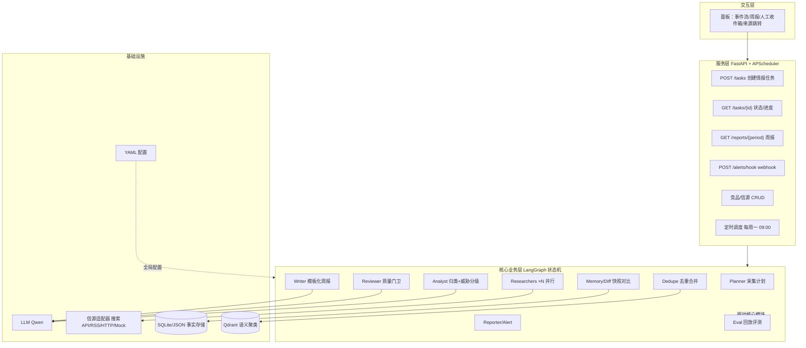
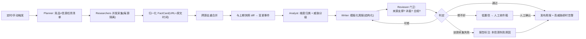

# 架构与骨架现状（architecture）

> 交付沿革：Phase 0 = 最小服务骨架 + Mock 底座；Phase 1 = 数据模型 + JSON/SQLite 持久化 + mock 语料切期；
> Phase 2 = 采集层 Researchers（并发采 3 类信源 → 归一化 FactCard，单源失败隔离）；
> Phase 3 = Dedupe 去重合并 + Memory/Diff 跨期 diff（FactCards → Events → 与上期快照比 → 变更事件 + 写档）；
> Phase 4 = LangGraph 编排状态机把 P1–P3 串成周期流水线（Planner→Researchers→Dedupe/Diff→Analyst→Writer→Reviewer，全 mock）；
> Phase 5 = 把 analyst（威胁分级 rubric high/medium/low + 理由链）与 writer（WeeklyReport schema 强制合规）做实，图一条边不改；
> Phase 6 = 把 reviewer 从"结构门卫"做实为"审稿门卫"（grounding 闭环自证 + 显式反义极性矛盾 + 与上期重复 +
> 打回限次 + 人工收件箱 + gate_trace 审计迹），评审逻辑拆进 reviewer 包，图仍一条边不改；
> Phase 7 = 服务化：`service/` 把 Phase 4–6 的单条 run_cycle 包成"本期巡检 Task"——FastAPI 任务管理
> （POST /tasks 同步执行返回终态）+ APScheduler 定时（每周一 09:00）+ 告警 webhook 适配（Mock 台账 /
> Webhook 壳 fail-fast）+ **run 级失败隔离**（一竞品挂不影响其它）+ **trace 计数链收口**
> （采集 N→去重 M→diff K→门卫拦 X 在服务层可查），全在 app/routers 暴露 HTTP。
> Phase 8 = 把 P7 的先审后发推到「能闭环」并配上评测：`service/publish.py` 给人工收件箱加
> **resolution 语义**（release/dismiss = 销案终态、note = 只备注不销案，审计落 run.human_inbox）；
> **发布视图** `published_view` 把周报 draft 按 resolution 过滤成 published / held / dismissed；
> **简单面板** `app/routers/panel.py`（零构建 HTML + 原生 JS，调同款 JSON API）；**Eval-Harness**
> `eval/` 给流水线加「固定语料回放评测 + 自动门禁」（回归一致性 / gold 真值集 7/7 / 对抗 6 场景全拦）。
> 增量「跨竞品横向对比」= 在 Phase 8 发布视图之上加一层"横着看"：`compare/` 把 Task 内各竞品**已放行**条目
> 按共享 dimension 轴对齐（维度对齐 ≠ 实体对齐——谁先动比最早 first_seen、单边动作=事实陈述、同维度高威胁并列
> 计数不跨竞品排危险序；先审后发纪律延续：held/dismissed 不进对比），服务化 = `service/compare.py` +
> GET /tasks/{id}/compare + 面板横向对比段（不足两家已放行 422 明说无可比）。
> 本文先落两张与设计稿一致的 Mermaid（见 `README2.md` §4.1/§4.2），再给"今天真实能跑的部分 / 未来挂载点"对照，
> 避免 README 只画将来、落地只有壳。数据模型细节见 [`docs/schema.md`](schema.md)，采集层细节见 [`docs/collectors.md`](collectors.md)，
> 去重与跨期 diff 细节见 [`docs/memory.md`](memory.md)，编排状态机细节见 [`docs/orchestrator.md`](orchestrator.md)，
> Analyst 分级 + Writer 周报细节见 [`docs/analyst_writer.md`](analyst_writer.md)，Reviewer 审稿门卫细节见 [`docs/reviewer.md`](reviewer.md)，
> 服务层（任务/定时/告警/健壮性）细节见 [`docs/service.md`](service.md)，人工放行闭环 / 发布视图 / 简单面板
> 见同一文档 Phase 8 段落，Eval-Harness 回放评测细节见 [`docs/eval.md`](eval.md)，跨竞品横向对比
> 细节见 [`docs/compare.md`](compare.md)。

---

## 1. 系统分层架构（目标，同设计稿 §4.1）



## 2. 主流程（目标，同设计稿 §4.2）



---

## 3. 落地现状对照表（截至 Phase 7：哪些"今天就能跑"，哪些是占位）

| 层 | 设计稿节点 | 状态 | 落地位置 |
|---|---|---|---|
| 服务层 | FastAPI | ✅ `/health` + `/` + 业务路由，version 0.9.0 | `app/main.py` |
| 服务层 | 任务/报告/告警 API | ✅ Phase 7 全套：POST /tasks（建+同步执行返回终态）/ GET /tasks / {id} / {id}/report（合并 pipeline draft）/ GET /inbox（人工收件箱）/ GET /alerts / POST /alerts/hook | `app/routers/{tasks,inbox,alerts,deps}.py` + `service/` |
| 服务层 | 人工放行闭环 / 发布视图 | ✅ Phase 8：POST /inbox/resolve（release/dismiss=销案终态、note=只备注不销案，审计 by/note/resolved_at 落 run.human_inbox，entry_id=`{run_id}#{seq}`）+ GET /tasks/{id}/published（draft → published/held/dismissed 过滤；PASS 全自动发布） | `service/publish.py` + `app/routers/{inbox,tasks}.py` |
| 服务层 | 简单面板（人工放行 + 告警可视化） | ✅ Phase 8 零构建 HTML：/panel 总览 + /panel/task/{id} 单任务（收件箱 放行/驳回/备注 按钮 + 发布视图，原生 JS 调同款 JSON API） | `app/routers/panel.py` |
| 服务层 | 跨竞品横向对比 | ✅ 增量：`compare/` 纯函数（维度轴对齐 ≠ 实体对齐；已放行条目对齐 + first_mover/单边动作/雷达并列）+ GET /tasks/{id}/compare + 面板段（<2 家已放行 422 明说无可比） | `compare/{model,builder}.py` + `service/compare.py` + `app/routers/{tasks,panel}.py` |
| 服务层 | 任务执行 = Task（本期×多竞品） | ✅ Phase 7 `ServiceRunner.execute_task`：逐 run 执行、**run 级失败隔离**、终态 completed/partial/failed + 聚合 summary | `service/{runner,store,schemas}.py` |
| 服务层 | trace 计数链收口 | ✅ Phase 7：RunMeta.trace + TaskMeta.summary.chains（采集 N→去重 M→diff K + verdict + gate_problems + inbox） | `service/schemas.py` / `service/runner.py` |
| 服务层 | 告警 Notifier | ✅ Phase 7：high_threat / human_inbox / run_failed → Mock 落台账（默认离线）；Webhook 壳空 url fail-fast、deliver 抛 NotImplemented（真 HTTP 推送接入期） | `service/notifier.py` + `config alerts.webhook_url` |
| 服务层 | APScheduler 定时 | ✅ Phase 7 注册 weekly_report job（config.schedule.cron 每周一 09:00，day-of-week 用名字 mon 免 APScheduler 数值歧义）；`schedule.enabled=false` 缺省不启，lifespan true 才 start | `service/scheduler.py` + `config config.yaml schedule` |
| 基础设施 | 配置 YAML | ✅ fail-fast 强类型 | `config/config.yaml` + `config/settings.py` |
| 基础设施 | LLM 抽象 | ✅ Mock 离线默认 | `llm/base.py` `mock_provider.py`；dashscope 壳未接 key（`dashscope_provider.py` raise） |
| 基础设施 | 信源适配器 | ✅ 抽象 + MockSource | `sources/base.py` + `sources/mock.py`；真实 HTTP/RSS adapter 仍占位（无 key 离线优先） |
| 基础设施 | Mock 数据 | ✅ 2 竞品 × 3 信源 × 两周 | `fixtures/sources/{crm_alpha,bi_beta}.json`（W34/W35 两期可切） |
| 基础设施 | SQLite/JSON 事实存储 | ✅ Phase 1 json 默认 / sqlite 可切，幂等覆盖 | `memory/{schemas,fingerprint,store,corpus,diff}.py`；根 `data/memory/` |
| 基础设施 | 核心数据对象 | ✅ FactCard/Event/Snapshot schema 定全（Event 实例 Phase 3 已产出） | `memory/schemas.py` + `docs/schema.md` |
| 基础设施 | Qdrant 语义聚类 | ⬜ 后置占位（语义近并仍未做，走确定性规则） | `config vector_db`（占位） |
| 核心业务层 | Researchers 并发采集 | ✅ Phase 2 collectors | `collectors/{schemas,normalize,worker,factory,orchestrator}.py` + `docs/collectors.md` |
| 核心业务层 | Dedupe 去重合并 | ✅ Phase 3 规则分类 + 版本锚/近原文聚类 | `dedupe/{classify,merge,__init__}.py` + `docs/memory.md` |
| 核心业务层 | Memory/Diff 跨期 diff | ✅ Phase 3 fp 认人 + digest 认内容 → add/change/remove/unchanged | `memory/diff.py`（build_snapshot/diff_event_sets/mark_removed）+ `docs/memory.md` |
| 核心业务层 | Analyst 威胁分级 | ✅ Phase 5 规则阶梯 high/medium/low + 理由链（确定性/可解释/只读维度不改 fp） | `analyst/{rubric,classifier}.py` + `docs/analyst_writer.md` |
| 核心业务层 | Writer 模板化周报 | ✅ Phase 5 WeeklyReport schema 自校验（headline/雷达/kind/sources；只组装不发挥） | `writer/{report,service}.py` + `docs/analyst_writer.md` |
| 核心业务层 | Reviewer 质量门卫 | ✅ Phase 6 审稿门卫：grounding 闭环自证（URL/fp/命中词）+ 显式反义极性矛盾 + 与上期重复；typed problems，结构性缺口 REWRITE 限次、信任类问题直转人工收件箱（gate_trace 审计迹） | `reviewer/{gate,problems}.py` + `orchestration/nodes.py`（reviewer_node 路由）+ `docs/reviewer.md` |
| 核心业务层 | Alert（告警） | ✅ Phase 7 由 `service/notifier.py` 承担（高威胁即时告警 + 转人工告警 + run 失败告警 → Mock 台账 / Webhook 壳）；Reporter 类里原"告警"职责已实现在服务层 | `service/notifier.py` + `docs/service.md` |
| 核心业务层 | Reporter（周报对外发布/推送） | 🟡 周报对外"推送"仍无真实渠道——发布闭环止于 published_view（HTTP 查询态的可复核快照）；Reporter 类 + 真渠道留接入期 | `service/publish.py`（published_view）；`reporter/publisher.py`（Reporter 占位类） |
| 核心业务层 | Eval 回放评测 | ✅ Phase 8 Eval-Harness：三面六指标（回归一致性 + gold 真值 7/7 + 对抗注入 6 场景全拦 + 来源/grounding + 结构合规 + trace 计数链）+ 门禁（config eval 阈值，fail 退出码 1）；真实语料 0 误拦 | `eval/{dataset,adversarial,metrics,harness,run}.py` + `config config.yaml eval:` + `docs/eval.md` |
| 核心业务层 | LangGraph 状态机 | ✅ Phase 4–6（analyst/writer P5、reviewer P6 做实，图一条边不改） | `orchestration/{state,planner,nodes,graph,pipeline}.py` + `docs/orchestrator.md` |

> 图里 P1–P8 的灰块是**目标态**；上表第二列标了它们此刻对应哪个 Phase。交付口径：
> Phase 1 交付 = 三类对象 schema 定全、JSON/SQLite 可存可取（幂等覆盖）、mock 语料可切 W34/W35 两期快照
> ——给 Phase 3 diff 留档的地基。
> Phase 2 交付 = **采集层**：每源一个 CollectorWorker 并发采（asyncio+信号量限流）、RawItem→FactCard 唯一归一化入口、
> 单源失败隔离进 failures 清单不中断全局、trace 计数链第一节（fetched→cards→failed）。
> Phase 3 交付 = **去重 + 跨期 diff**：确定性维度分类（fp 定锚前置）+ 版本锚/近原文聚类（Evidence 聚合）
> + 上期快照 vs 本期事件 diff（add/change/unchanged + 显式 remove，Snapshot 增 event_digests 判变更）。
> Phase 4 交付 = **LangGraph 编排状态机**：planner / researchers / dedupe_diff 是真节点（复用 P1–P3 已测库），
> analyst / writer / reviewer 以薄节点落地（结构真、逻辑留给 P5/P6），共享可序列化 State + checkpoint + 门卫条件边，
> 全 mock 下 81 测试全绿（编排 14 条）——一条命令出「周报初稿 + 门卫判定」。
> Phase 5 交付 = **Analyst 分级 + Writer 合规周报**：analyst 用 ThreatRubric 规则阶梯（先命中先定级）给每条 diff 出的
> 变更事件打 high/medium/low + 理由链（确定性可解释，只读维度不改 fp）；writer 把已分级条目组装成 WeeklyReport
> （pydantic 自校验 headline/雷达/kind/sources，只组装不发挥）；reviewer 补查"已分级带理由"。图一条边不改，
> 全 mock 下 110 测试全绿（编排 17 条）——`demo_two_weeks()` 直接打印威胁雷达，radar 之和 == diff K。
> Phase 6 交付 = **Reviewer 审稿门卫**：reviewer 从编排内联拆成真包（`reviewer/{gate,problems}.py`），把"结构门卫"
> 做实成三条语义判定里能确定性的部分——grounding **闭环自证**（evidence_url 必在本期采集卡、fp 必在本期 diff
> 变更集、理由命中词必在正文 → 编造 URL / 凭空 fp / 张冠李戴各拦截）+ 显式反义极性矛盾（同轴反词 + 共享主体锚 →
> 转人工不自动二选一）+ 与上期重复防御。typed problems（带 code）进 gate / gate_trace（打回有 trace）/
> human_inbox（人工收件箱）；路由铁律：结构缺口 REWRITE 限次（review_max_rewrites=2）、信任类问题直转 human
> 不消耗额度。图仍一条边不改，全 mock 下 123 测试全绿（reviewer gate 13 条）——注入 6 类假事件全拦（6/6）、
> 真实 W35 语料 0 误拦。
> Phase 7 交付 = **服务化（任务/定时/告警/健壮性）**：`service/` 把单条 run_cycle 包成 Task——execute_task 逐 run
> （**run 级失败隔离**：一竞品挂记 failed+error、健康竞品照常 done，Task=partial）+ **trace 计数链收口**进
> RunMeta / summary.chains（采集 N→去重 M→diff K + verdict / gate_problems / inbox）+ 告警 Notifier
> （high_threat / human_inbox / run_failed → Mock 台账默认，Webhook 壳空 url fail-fast 诚实占位）+
> APScheduler weekly_report（每周一 09:00，day-of-week 用名字 mon 免数值歧义）+ FastAPI routers
> （POST /tasks / GET /tasks / {id} / {id}/report / GET /inbox / GET /alerts / POST /alerts/hook）。
> 两条故障演练注入测试锁死（run 挂 → partial + run_failed 告警；假 writer → human + 收件箱 + human_inbox 告警）。
> 全 mock 下 144 测试全绿（service 21 条：runtime 13 + api 8）。
> Phase 8 交付 = **Eval-Harness 回放评测 + 人工放行闭环 / 发布视图 / 简单面板**：`eval/` 五模块
> （dataset 存 gold 真值 + 去重重复组 / adversarial 六对抗场景 / metrics 六指标纯函数 / harness 三面回放 /
> run 门禁 CLI）+ config `eval:` 门禁块。三面：**回归一致性**（真实 W34/W35 冻结语料回放，trace 5→3→3 /
> 5→4→4、radar、verdict 全 PASS 等规范数字锁死，真实语料 0 误拦）、**gold 真值集**（手标 7 事件 →
> 事件一致率 7/7 + 去重组全并 + 每周报来源都真采集到）、**对抗注入**（unsourced_url / ungrounded_fp /
> ungrounded_claim / contradiction 各单码纯、mixed 双码、duplicate 门卫级 → 6 场景全拦、编造拦截率 1.0）。
> `service/publish.py`：收件箱条目带稳定 entry_id=`{run_id}#{seq}`，resolution 语义（release/dismiss = 销案
> 终态不可覆盖、note = 只备注不销案；by/note/resolved_at 审计落 run.human_inbox）；`published_view` 把 draft 按
> resolution 过滤成 published / held / dismissed（PASS 全自动发布、未放行/带 note 挂 held、dismissed 进审计剔除区）。
> `app/routers/panel.py` 零构建 HTML 面板（收件箱 放行/驳回/备注 按钮 + 发布视图 + 告警可视化，原生 JS 调同款
> JSON API）。main 0.9.0；全 mock 下 **215 测试全绿**（基线 149 + eval 15 + panel 7 + 横向对比 16 +
> 审计回归 3：service_runtime 并发锁 ×2、dedupe 空标题丢卡 ×1 + 第三轮审计回归 16：tests/test_audit_round3.py——
> 采集断档不覆写上期快照 ×3、告警投递失败隔离 ×2、损坏容忍+原子写 ×4、版本锚 NFKC+纯品牌名不乱并 ×4、
> period 422 请求期校验 ×1、collect_failures 可见 ×1、面板 entry_id 不内联 JS ×1 + 第四轮审计回归 9：
> tests/test_audit_round4.py——SQLite 读容忍 ×2、latest_snapshot(up_to=) 回填重跑锚定 ×3、版本点号撞指纹
> （v12.0≠v1.20）×3、collection_gap 过真实 LangGraph ×1）。
> 增量交付口径 = **跨竞品横向对比**：把"单竞品各交各的周报"升级为"同 Task 里横着看"。`compare/`（model+builder）
> 吃发布视图的**已放行**条目，产出 competitor 雷达列头 + dimension 行 + derived（全员动作维度 / 单边动作维度 /
> 率先维度计数）。确定性：竞品按 id 规范化、行按 Dimension 声明序、格内 (first_seen,fp,title) 稳定排序、雷达一律
> 由 items 重算；`service/compare.py` 映射发布视图 → build，GET /tasks/{id}/compare 输出（<2 家已放行 422），面板 task
> 页加横向对比表（★ 先行方）。实测（真实 W35 批量 Task，两竞品 PASS 全自动发布）：feature 双竞品都动、
> bi 先动（最早 08-24 < crm 08-25）；market 仅 bi（盘点 = 单边动作）；雷达/维度覆盖并列如实。
> ——**不宣称已连真实网络 / 已产出 LLM 情报 / 已能语义判同 / 已真推告警 / eval 数字=真实世界表现 / 横向对比=实体等价**：
> 真实 adapter 与
> 跨竞品 fan-out 在接入期；Webhook 是占位壳（真 HTTP 推送接企微/飞书/邮件要真实 endpoint/key，属接入期）；
> Eval-Harness 是**固定语料回归基线**（gold 7 事件 + 6 对抗场景是"编得动的口径"，不是真实世界命中率；
> duplicate 为门卫级而非图级，见 docs/eval.md §4）；LLM 语义补分级（异词同威胁）与 Reviewer 的
> "读原文语义 grounding"都在规则/自证之后加一层（provider-gated，本期未接）；语义近并（embedding/Qdrant）后置占位
> （近原文去重仍走确定性规则，见 docs/memory.md 边界表）。

## 4. 目录骨架

```
competition-watch-engine/
├─ app/main.py            # FastAPI 入口：GET / /health + 业务路由（version 0.9.0，Phase 8 含面板 + 横向对比）
├─ config/config.yaml     # 业务参数（全参数占位）
├─ config/settings.py     # pydantic 强类型 + fail-fast（dashscope 无 key 即报错）
├─ llm/                   # Provider 抽象：base / mock_provider / dashscope_provider(壳) / get_provider
├─ sources/               # SourceAdapter 抽象 + MockSource（读 fixtures/sources）
├─ fixtures/
│  ├─ sources/{crm_alpha,bi_beta}.json   # 2 竞品 × website/news/rss × 08-17..08-30
│  └─ llm/reply.json      # MockProvider 固定回复
├─ memory/                 # Phase 1+3：schemas(数据对象) / fingerprint(fp) / store(双后端) / corpus(语料切期)
│  │                       #          / diff(跨期比对: build_snapshot/diff_event_sets/mark_removed)
│  └─ __init__.py          # 导出 FactCard/Event/Snapshot、MemoryStore、diff_event_sets、build_period_cards 等
├─ collectors/             # Phase 2：schemas(统计/结果) / normalize(RawItem→FactCard) / worker(隔离+重试占位)
│  │                       #          / factory(每源一个 Worker) / orchestrator(信号量并发汇总)
│  └─ __init__.py          # 导出 build_collectors/collect_competitor/collect_all/CollectSummary 等
├─ dedupe/                 # Phase 3：classify(维度规则分类,fp 定锚前置) / merge(版本锚+近原文聚类→Events)
│  └─ __init__.py          # 导出 classify_dimension/version_anchor/merge_to_events/read_competitor_aliases
├─ orchestration/          # Phase 4–6：state(共享可序列化 State + gate_trace/human_inbox) / planner(周期换算)
│  │                       #          / nodes(七节点; analyst·writer P5、reviewer_node P6 路由做实)
│  │                       #          / graph(StateGraph+MemorySaver+门卫条件边) / pipeline(run_cycle/demo_two_weeks)
│  └─ __init__.py          # 导出 Planner/PeriodRunState/build_graph/run_cycle/demo_two_weeks
├─ analyst/                # Phase 5：rubric(规则阶梯: 先命中先定级 + 理由链) / classifier(Analyst.grade → write_items)
├─ writer/                 # Phase 5：report(WeeklyReport/ReportItem 模型自校验) / service(Writer.build 只组装不发挥)
├─ reviewer/               # Phase 6：gate(Reviewer.review → typed problems: grounding/矛盾/合规) / problems(代码+路由表)
├─ compare/                # 增量横向对比：model(CompetitorView/CrossCompareReport 结构) / builder(build 纯函数：
│  │                       #          维度轴对齐≠实体对齐；已放行条目对齐 + first_mover/单边/雷达并列，确定性)
├─ service/                # Phase 7+8：schemas(Task/Run/Alert 契约) / store(TaskStore 文件即状态+告警台账)
│  │                       #          / runner(execute_task: run 级隔离+计数链收口+告警) / notifier(Mock/Webhook)
│  │                       #          / scheduler(weekly_report cron 注册) / publish(Phase 8: resolution
│  │                       #          语义 + published_view 发布视图过滤) / compare(增量: compare_view 横向对比)
│  │                       #          / context(ServiceContext 依赖)
│  └─ __init__.py          # 导出 build_service_context/ServiceRunner/run_now/MockNotifier/WebhookNotifier 等
├─ app/routers/            # Phase 7+8：deps(get_service_ctx) / tasks(+/{id}/published +/{id}/compare) / inbox(+resolve)
│  │                       #          / alerts / panel（task 页含横向对比段，★ 先行方）
├─ eval/                   # Phase 8：dataset(gold 真值/去重重复组) / adversarial(6 对抗场景+毒化 writer)
│  │                       #          / metrics(六指标纯函数) / harness(EvalHarness 三面回放+render_markdown)
│  └─ run.py               # check_gates 门禁 + python -m eval.run CLI（写 data/eval/eval_report.{json,md}，fail=1）
├─ reporter/publisher.py   # 占位类（Reporter 告警职责已归 service/notifier；周报对外真推送留接入期）
│                          # ——发布闭环止于 service/publish.published_view（HTTP 查询态可复核快照）
├─ docs/architecture.md    # 本文
├─ docs/schema.md          # 数据模型与持久化（Phase 1）
├─ docs/collectors.md      # 采集层设计：并发/隔离/计数说明（Phase 2）
├─ docs/memory.md          # 去重合并与跨期 diff（Phase 3）
├─ docs/orchestrator.md    # 编排状态机（Phase 4）
├─ docs/analyst_writer.md  # Analyst 威胁分级 + Writer 模板化周报（Phase 5）
├─ docs/reviewer.md        # Reviewer 审稿门卫（Phase 6）
├─ docs/service.md         # 服务层：任务/定时/告警/健壮性 + 人工放行闭环/发布视图/面板（Phase 7+8）
├─ docs/eval.md            # Eval-Harness 回放评测：三面六指标 + 对抗表 + 口径声明 + 门禁（Phase 8）
├─ docs/compare.md         # 跨竞品横向对比：口径/边界（维度≠实体）/实测（增量）
└─ tests/                  # health/mock_provider/mock_source/schema/fingerprint/store/factory/corpus/collectors/dedupe/diff/orchestration_graph/analyst_rubric/writer_report/reviewer_gate/service_runtime/service_api/eval/panel_api/compare_builder/compare_api
```
`data/memory/`（运行产物，gitignored）：json 后端 = `fact_cards|snapshots/{竞品}/{period}.json`；sqlite = `memory.db`。
`data/service/`（运行产物，gitignored）：`tasks/{task_id}.json`（TaskMeta 文件即状态）+ `alerts.json`（告警台账）。

## 5. Mock 数据语义（fixtures/sources）

- 每竞品一份 JSON：`id/name/aliases/items[]`；`items` 字段对齐 `RawItem`（kind/url/published_at/title/summary）。
- **为去重预置跨源重复事件（Phase 3 已用 fixtures 真值验证）**：`crm_alpha` 的 v12.0 发布在 website(官网博客 08-25 08:00) + rss(changelog 08-25 08:05) + news(媒体 08-25 11:30) 三处重复，
  `bi_beta` 图表库 3.0 在 website + news 两处重复 —— 版本锚聚类把它们并成一条 Event（`evidence_urls` = 3 / 2），
  测试锁死（`tests/test_dedupe.py`：crm W35 5→3、bi W35 5→4）。
- 时间戳跨两周（2026-08-17..08-30），`since=上周` 增量过滤可直接在 `MockSource.fetch` 复现。

## 6. 运行方式

```bash
uv sync                      # 安装依赖（含 dev: pytest/httpx + langgraph + fastapi + uvicorn + apscheduler）
uv run pytest                # 全绿（当前 = 215）
uv run uvicorn app.main:app --port 8000   # 服务化 HTTP：/health + /tasks + /inbox + /alerts + /panel（0.9.0）
# 数据层验证：见 docs/schema.md §6（语料切期 / 双后端 round-trip）
# 采集层验证：见 docs/collectors.md §5（并发采集 / 失败隔离手工跑法）
# 去重 + 跨期 diff 验证：见 docs/memory.md §6（dedupe W35 5→3，diff adds=3）
# 编排验证：见 docs/orchestrator.md §7（demo_two_weeks 回放：trace 2→2→2 / 5→3→3，gate 全 PASS + 审计字段）
# 分级 + 周报验证：见 docs/analyst_writer.md §7（threat_radar 之和 == diff K：crm {1,1,1} / bi {1,1,2}）
# 门卫验证：见 docs/reviewer.md §8（注入 6 类假事件全拦 6/6、真实 W35 0 误拦；打回有 trace）
# 服务层验证：见 docs/service.md §10（POST /tasks 计数链 + /report + /inbox + /alerts；故障演练 A/B；每周一 09:00 cron）
# 评测验证：见 docs/eval.md §7（uv run python -m eval.run → 三面六指标 + 门禁；fail 退出码 1）
# 横向对比验证：POST /tasks 跑 W35 双竞品 → GET /tasks/{id}/compare（feature 双动 + bi 先动 + market 单边）；见 docs/compare.md
```

---

_更新日志_：2026-09-03 建（Phase 0 交付）；2026-09-03 更新（Phase 1：DB 行 ✅、目录骨架加 memory 模块、docs/schema.md）；
2026-09-03 更新（Phase 2：Researchers 行 ✅、目录骨架加 collectors 模块、docs/collectors.md、交付口径补 Phase 2）；
2026-09-03 更新（Phase 3：Dedupe + Memory/Diff 行 ✅、目录骨架加 dedupe 模块与 memory/diff.py、docs/memory.md、交付口径补 Phase 3）；
2026-09-03 更新（Phase 4：LangGraph 状态机行 ✅、薄节点行 🟡、Qdrant 行改后置、目录骨架加 orchestration 模块、docs/orchestrator.md、交付口径补 Phase 4）。
2026-09-03 更新（Phase 5：Analyst/Writer 行 ✅ 拆出、Reviewer 行 🟡、目录骨架加 analyst/writer 模块与 docs/analyst_writer.md、交付口径补 Phase 5）。
2026-09-04 更新（Phase 6：Reviewer 行 ✅ 拆成 reviewer 包、LangGraph 行 4–6、目录骨架加 reviewer 模块与 docs/reviewer.md、pytest 110→123、交付口径补 Phase 6）。
2026-09-04 更新（Phase 7：服务层行 ✅、任务/报告/告警 API 与 APScheduler 行 ✅、Reporter/Alert 行拆出（Alert 归 service/notifier）、目录骨架加 service 与 app/routers 模块、docs/service.md、pytest 123→144、交付口径补 Phase 7）。
2026-09-04 更新（Phase 8：Eval 行 ✅（reporter/publisher 拆成占位）、人工放行闭环/发布视图/简单面板行 ✅、FastAPI version 0.7.0→0.8.0、目录骨架 eval/ 转实 + service/publish.py + app/routers/panel.py + docs/eval.md、pytest 144→165、交付口径补 Phase 8、沿革/不宣称段落补 P8 边界）。
2026-09-04 更新（增量横向对比：跨竞品横向对比行 ✅、FastAPI version 0.8.0→0.9.0、目录骨架加 compare/ 包 + service/compare.py + app/routers compare 路由/面板段 + docs/compare.md、pytest 165→180、沿革/不宣称段落补"横向对比≠实体等价"边界）。
2026-09-04 更新（全面审计收尾三轮：TaskStore/告警台账损坏容忍与并发锁、runner 告警投递失败隔离、采集断档不覆写
上期快照 guard + 记 failed、collect_failures 上报、POST /tasks period 越界 422 预校验、版本锚 NFKC/纯品牌名不乱并、
panel entry_id 改 data-eid 不内联 JS；pytest 全绿 → 206，本轮新增回归 16：tests/test_audit_round3.py）。
2026-09-04 更新（全面审计第四轮：SqliteMemoryStore 读容忍对齐 Json 后端、latest_snapshot(up_to=period) 修复重跑/回填
历史周期被更晚快照污染、normalize_title 保留 '.' 修复版本点号撞指纹（v12.0≠v1.20）、PeriodRunState 声明
collection_gap 修复其过真实 LangGraph 被丢弃；pytest 全绿 → 215，本轮新增回归 9：tests/test_audit_round4.py；
两 eval 门禁数字未变全绿）。
