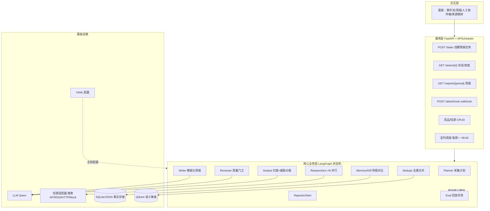
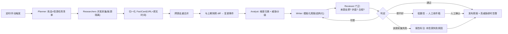

# 架构与骨架现状（architecture）

> Phase 0 交付：能跑的最小服务骨架 + Mock 底座。本文先落两张与设计稿一致的 Mermaid（见 `README2.md` §4.1/§4.2），
> 再给"今天真实能跑的部分 / 未来挂载点"对照，避免 README 只画将来、落地只有壳。

---

## 1. 系统分层架构（目标，同设计稿 §4.1）



## 2. 主流程（目标，同设计稿 §4.2）



---

## 3. 落地现状对照表（Phase 0：哪些"今天就能跑"，哪些是占位）

| 层 | 设计稿节点 | Phase 0 状态 | 落地位置 |
|---|---|---|---|
| 服务层 | FastAPI | ✅ `/health` + `/` 冒烟 | `app/main.py` |
| 服务层 | 任务/报告/告警 API | ⬜ Phase 7 routers | `app/routers/`（未建） |
| 服务层 | APScheduler 定时 | ⬜ Phase 7 | `config/config.yaml schedule`（占位） |
| 基础设施 | 配置 YAML | ✅ fail-fast 强类型 | `config/config.yaml` + `config/settings.py` |
| 基础设施 | LLM 抽象 | ✅ Mock 离线默认 | `llm/base.py` `mock_provider.py`；dashscope 壳未接 key（`dashscope_provider.py` raise） |
| 基础设施 | 信源适配器 | ✅ 抽象 + MockSource | `sources/base.py` + `sources/mock.py`；真实 HTTP/RSS 未实现（Phase 2） |
| 基础设施 | Mock 数据 | ✅ 2 竞品 × 3 信源 × 两周 | `fixtures/sources/{crm_alpha,bi_beta}.json` |
| 基础设施 | SQLite/JSON 事实存储 | ⬜ Phase 1 memory | `memory/store.py`（占位类） |
| 基础设施 | Qdrant | ⬜ Phase 3 | `config vector_db`（占位） |
| 核心业务层 | 8 个 Agent 模块 | ⬜ 类占位、无逻辑 | `orchestration/ collectors/ memory/ analyst/ writer/ reviewer/ reporter/ eval/` 各 `__init__` 暴露类名 |
| 核心业务层 | LangGraph 状态机 | ⬜ Phase 4 | `orchestration/` |
| 评测 | Eval | ⬜ Phase 8 | `eval/harness.py`（占位类） |

> 图里 P1–P8 的灰块是**目标态**；上表第二列标了它们此刻对应哪个 Phase。交付口径：Phase 0 交付
> "/health 能回 status=ok、默认 provider=mock、Mock 竞品在位"，不宣称"流水线已能跑"。

## 4. 目录骨架

```
competition-watch-engine/
├─ app/main.py            # FastAPI 入口：GET / /health
├─ config/config.yaml     # 业务参数（全参数占位）
├─ config/settings.py     # pydantic 强类型 + fail-fast（dashscope 无 key 即报错）
├─ llm/                   # Provider 抽象：base / mock_provider / dashscope_provider(壳) / get_provider
├─ sources/               # SourceAdapter 抽象 + MockSource（读 fixtures/sources）
├─ fixtures/
│  ├─ sources/{crm_alpha,bi_beta}.json   # 2 竞品 × website/news/rss × 08-17..08-30
│  └─ llm/reply.json      # MockProvider 固定回复
├─ orchestration/ collectors/ memory/ analyst/ writer/ reviewer/ reporter/ eval/
│                          # 8 业务包占位（Phase 4/3/5/6/7/8 落地类）
├─ docs/architecture.md   # 本文
└─ tests/                 # test_health / test_mock_provider / test_mock_source
```

## 5. Mock 数据语义（fixtures/sources）

- 每竞品一份 JSON：`id/name/aliases/items[]`；`items` 字段对齐 `RawItem`（kind/url/published_at/title/summary）。
- **为 Phase 3 去重预置跨源重复事件**：`crm_alpha` 的 v12.0 发布在 website(官网博客 08-25 08:00) + rss(changelog 08-25 08:05) + news(媒体 08-25 11:30) 三处重复，
  `bi_beta` 图表库 3.0 在 website + news 两处重复 —— 未来的事件指纹 `fp = hash(竞品, 维度, 规范化标题)` 靠这些同事件不同措辞验证。
- 时间戳跨两周（2026-08-17..08-30），`since=上周` 增量过滤可直接在 `MockSource.fetch` 复现。

## 6. 运行方式（Phase 0）

```bash
uv sync                      # 安装依赖（含 dev: pytest/httpx）
uv run pytest                # 全绿
uv run uvicorn app.main:app --port 8000   # 启动后访问 /health
```

---

_更新日志_：2026-09-03 建（Phase 0 交付）。
