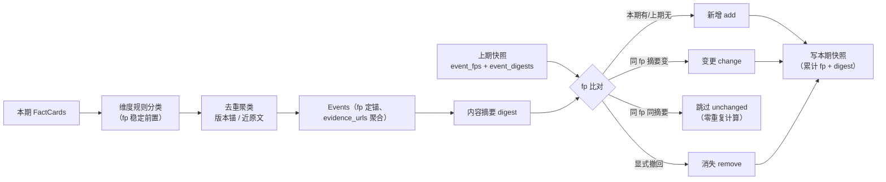

# 去重合并与跨周期 diff（Dedupe + Memory/Diff）

> Phase 3 交付：**去重合并**（FactCards → Events，同事件多源并一条、evidence_urls 聚合）
> + **跨周期 diff**（上期快照 vs 本期事件 → 新增/变更/消失变更事件，写周期快照）——README2 §4.4 / §5.4 / §5.5 落地。
> 设计要义：Event 首次去重即拿到稳定 `fp`（身份锚）；diff 靠 fp 认人、靠**内容摘要**判变没变；
> **消失只来自显式撤回**，绝不把"这周没报道"当成"从世界消失"。

---

## 1. 一次"跨期找变化"怎么跑



## 2. 三个核心概念 & 为什么

1. **维度为什么要 Phase 3 就先定（不让后续 Phase 再分类）**
   `Event.dimension` 必填，且 `fp = sha1(竞品|维度|规范化标题)` 把维度混进了身份。若之后（如 Analyst 层）再分类 →
   事件换维度 = fp 变 = 同一件事被 diff 成"消失 + 新增"。所以 Phase 3 用确定性关键词规则（`dedupe/classify.py`，
   README2 §5.6 口径"规则先命中，LLM 补语义"）**首次去重即定锚、冻结**。Phase 5 Analyst 只**读** `dimension`
   做威胁分级（填 severity + 理由，`analyst/rubric.py`），维度/fp/kind 一律不改（锁死测试见
   `tests/test_analyst_rubric.py::test_grade_never_rewrites_dimension_fp_kind`）。
2. **去重两层，本阶段落地"版本锚 + 近原文"，语义半层如实留 Phase 4**
   - 发布/上线类事件：**版本锚**（v12.0 / 3.0 / v12.1，正则 `\d+(\.\d+)+`）≈ 事件身份证——fixtures 里
     v12.0 的官网/changelog/媒体三源**措辞各不相同**仍并一条、`evidence_urls=3`；图表库 3.0 双源并入一。
   - 无版本锚的卡只并**近原文重复**（别名剔除后标题相同或几乎包含）。
   - **异词异义的语义近并（embedding）不实现、不硬凑**——Qdrant 语义聚类后置占位（P4 编排、P5 分级都未引入），
     docs/schema.md §3 承诺的边界照旧。
3. **diff 怎么判"变没变"：fp 认人，digest 认内容**
   只看 fp 集合只能判 add/remove/skip，判不了 change → Snapshot 扩展 `event_digests`（fp → 内容摘要 =
   证据 url 并集排序 + 压白摘要的 sha1）。同 fp 两期都在、摘要变 → `change`（返回本期内容，下游直接消费）；
   没变 → `unchanged`（**零重复计算**，README2 §5.5 省 token 的那台机器）；本期才出现的 fp → `add`。

## 3. 消失（remove）语义：显式撤回，绝不自动推断

- `remove` 只来自 `removed_fps`（显式撤回名单），入口 `mark_removed`：fp 不在上期快照 → `ValueError`
  （fail fast，撤一个不存在的东西是调用方 bug）。
- **上期有、本期没报道 ≠ 消失**：我们的 mock 两期话题故意不重叠，若自动推断，W34 每条"上线/更新"都会被
  误报成"消失"——假情报。自动过期/沉寂策略属 Phase 4 记忆层。

## 4. 跨期同一性的诚实边界（本阶段主动承认）

- **措辞变了再报道 = 本期按新增处理**。跨期语义同一性（"v12.0 发布"上月报道过、这月换个标题又发）
  需要语义记忆 + 向量库，属 Phase 4。本引擎只做确定性 fp/digest 比对。
- 因此 fixtures 两期 diff 的**自然结果是全 add**（见 §6 实测）；`change/remove/unchanged` 分类逻辑由
  `tests/test_diff.py` 用手工事件对锁死，真实三态要等更长历史（Phase 8 事件集回放）或 Phase 4 语义记忆。

## 5. trace 计数链（§5.10 第二、三节）

`DedupeSummary{cards_in, events_out, merges}`（去重剩 M）+ `DiffSummary{adds, changes, removes, unchanged}`（diff 出 K）。
采集 N → 去重剩 M → diff 出 K = 每期排障/复盘的三段计数，Phase 8 eval 直接断言。

## 6. 运行与验证

```bash
uv run pytest                        # 67 passed（Phase3 新增 23：dedupe 12 + diff 11）
# 手工看一次 去重 + 跨期 diff（crm_alpha W34→W35）：
uv run python -c "from datetime import datetime; from config.settings import get_settings; from memory import build_period_cards, build_snapshot, diff_event_sets; from dedupe import merge_to_events, read_competitor_aliases; import json; \
exec('def m():\n s=get_settings(); a=read_competitor_aliases(s.fixtures_path/\"sources\"); p=build_period_cards(s.fixtures_path/\"sources\",\"crm_alpha\",datetime(2026,8,31,9,0)); e34,_=merge_to_events(p[\"2026-W34\"],period=\"2026-W34\",aliases=a); e35,d=merge_to_events(p[\"2026-W35\"],period=\"2026-W35\",aliases=a); print(\"dedupe W35\", d.cards_in, \"->\", d.events_out); cs=diff_event_sets(build_snapshot(e34,\"crm_alpha\",\"2026-W34\"),e35); su=cs.summary(); print(\"diff:\", su.model_dump())\nm()')"
# → dedupe W35 5 -> 3
# → diff: {'adds': 3, 'changes': 0, 'removes': 0, 'unchanged': 0}
```

## 7. 局限（本阶段主动承认）

- **近义合并只到版本锚/近原文**：异词异义语义并（embedding）待 Phase 4 Qdrant；跨期措辞变体按新增。
- **change 判定靠 digest**：同 fp 但仅排版/证据 url 顺序变化不会误报（url 先排序、摘要先压白）；但"内容实质变但摘要与证据都没变"判不出——那是 Reviewer(Phase 6) 的地盘。
- **Event 记忆未持久化为独立实体**：本期以"快照(fp+digest) + 进程内 Event"承载；Phase 4 编排接入时再落 Event 存储。
- **单进程、无并发写**：同 Phase 1 口径。

---

_更新日志_：2026-09-03 建（Phase 3 交付）；2026-09-03 更新（Phase 5：§2 维度口径改过去时——Analyst 只读 dimension 分级、绝不改 dimension/fp/kind；Qdrant 语义近并口径后置）。
