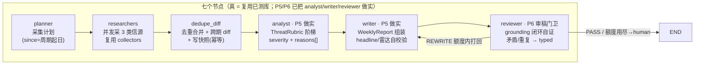

# 编排状态机 Orchestration（Phase 4–6）

> 交付沿革：Phase 1 = 数据模型 + 双后端持久化；Phase 2 = 采集层 Researchers（并发 + 单源失败隔离）；
> Phase 3 = Dedupe 去重合并 + Memory/Diff 跨期 diff。Phase 4 = **用 LangGraph 把 P1–P3 串成一条可跑的周期流水线**：
> `Planner → Researchers(并行) → Dedupe/Diff → Analyst → Writer → Reviewer`，一条命令出「周报初稿 + 门卫判定」。
> Phase 5 = **把 analyst（rubric 分级）+ writer（WeeklyReport schema 合规）做实**，图一条边不改，`demo_two_weeks()`
> 直接打印威胁雷达。Phase 6 = **把 reviewer 从"结构门卫"做实为"审稿门卫"**（grounding 闭环自证 + 反义极性矛盾 +
> 与上期重复 → typed problems），评审逻辑拆进 reviewer 包、节点只做路由，图仍一条边不改，并新增
> `gate_trace`（打回有 trace）/ `human_inbox`（人工收件箱）两个审计 key。本文先讲"为什么选状态机"，
> 再给节点契约 / 共享 State / 门卫条件边 / 真值 trace，最后给局限。
> 分级与周报口径的细节在 [`docs/analyst_writer.md`](analyst_writer.md)，审稿门卫细节在 [`docs/reviewer.md`](reviewer.md)。

---

## 1. 一张图看懂：编排状态机



LangGraph 是**图运行时、不是 LLM**：七个环节里大多数是纯 Python 节点（复用已测逻辑），
P5 的 analyst（确定性规则分级）/ writer（pydantic 组装）与 P6 的 reviewer（grounding/矛盾确定性审稿）
仍是纯 Python —— 只有更远的"读原文语义"审稿才需要在节点内接 Mock/Qwen LLM。
因此全 mock 下编排层也能被确定性测死（123 测试含 17 个编排 + 13 个 reviewer gate）。

## 2. 为什么用"图状态机"而不是顺序脚本（面试讲这三点）

1. **共享可序列化 State 传数据**：节点函数契约是 `(state) -> 部分更新`，LangGraph 按 key 合并进同一份
   State（`PeriodRunState`，全部 JSON-safe 的 dict/list/str/int）。好处：State 可整体落盘（文件即状态）、
   可 checkpoint 断点续跑、每个 key 谁写谁读一目了然 —— 比 20 个函数手动传参/返回值接龙更不易漏。
2. **条件边让流程可循环、可中断、可人工介入**：Reviewer 门卫判 `REWRITE` 就沿条件边**回到 Writer 再写一次**，
   额度用尽判 `human`（转人工收件箱）而不是硬放行 —— "先审后发、低置信转人工"在编排层是**图的结构**，不是口头约定。
3. **节点边界 = 可插桩可替换**：每个节点独立可测；P5 已把 analyst/writer 内部做实、P6 将把语义审稿做实，
   **图一条边都没改**（依赖注入 ctx，测试还可 monkeypatch 单节点注入故障/坏输出验证门卫）。

对应工程可见物：`PeriodRunState` 定义了整条流水线的"数据契约"（新增一个中间产物 = 加一个 key）；
`route_after_review` 是唯一一条条件边；MemorySaver 按 thread_id(=run_id) 存每轮 checkpoint。

## 3. 七个节点契约

| 节点 | 读 State 关键 key | 做什么 | 写 State key | 真/薄 |
|---|---|---|---|---|
| planner | competitor_id / period / fetched_at | 算 since=周期起日、run_id、启用信源清单 | plan | 真（`orchestration/planner.py`） |
| researchers | plan | 每源一个 Worker 并发采（asyncio+信号量），单源失败进 failures 不中断 | collect_summary / cards | 真（复用 `collectors`） |
| dedupe_diff | cards | 只留落在本周期的卡 → `merge_to_events` → 与上期快照 `diff_event_sets` → 写本期快照（幂等） | events / changes / diff_summary / removed_fps / unchanged_fps / trace | 真（复用 `dedupe` + `memory.diff`） |
| analyst | changes | 用 ThreatRubric 规则阶梯给每条 diff 出的变更事件打 severity(high/medium/low) + reasons[]（确定性；只读 dimension、不改 fp） | write_items | 真（P5，`analyst/{rubric,classifier}.py`） |
| writer | write_items / diff_summary | 组装合规 WeeklyReport：headline/sections/items + 重算 threat_radar + 出处并集 sources（schema 自校验，只组装不发挥） | draft | 真（P5，`writer/{report,service}.py`） |
| reviewer | draft / rewrites / cards / changes / unchanged_fps | P6 审稿门卫：Reviewer().review 用**本 run 证据**核 grounding（URL 必在本期采集卡 / fp 必在本期 diff 变更集 / 理由命中词必在正文）+ 反义极性矛盾 + 与上期重复，产出 typed problems；节点按路由表判 REWRITE(结构缺口额度内) / human(信任直转 + 结构用尽)，追加审计迹、落人工收件箱 | gate / rewrites / gate_trace / human_inbox | 真（P6，`reviewer/{gate,problems}.py` + 路由在 nodes） |

> 数据流里的 pydantic 只出现在节点内部（转 model 用一下）；写进共享 State 的永远是 JSON-safe dict，
> 所以"State 可序列化"字面成立 —— `persist=True` 直接把最终 state 落 `data/pipeline/{run_id}.json`。

## 4. 共享 State 与 checkpoint

- `PeriodRunState`（`orchestration/state.py`）按"采集→记忆→写作→门卫"分段声明 key，全部可 JSON 序列化。
  P6 新增两个门卫审计 key：`gate_trace`（每次判定 append 一条，打回有 trace）与 `human_inbox`
  （verdict=human 时把问题条目落箱，人工确认才放行）。
- 编译时挂 `MemorySaver()`：`run_id` 即 thread_id，`app.get_state(config)` 可取回某轮最终状态（测试已锁）。
- 记忆写档在 **dedupe_diff 节点内部**完成（`save_snapshot` 幂等覆盖同一 (竞品,期)），因此：
  单跑一个周期 = 冷启动（无上期 → 本期事件全 add）；要看到跨期"新增/变更/消失"必须先跑过上期写档 ——
  这正是 Snapshot（记忆）存在的意义，也是 `demo_two_weeks` 先 W34 后 W35 的原因。

## 5. 门卫与条件边：typed problems、打回额度、转人工、审计迹

Reviewer（P6，`reviewer/gate.py::Reviewer().review`）是**问题清单生成器**，产出带 code 的
`ReviewProblem`；节点 `reviewer_node` 是路由表。判定流（`config.pipeline.review_max_rewrites=2`，测试锁死）：

- **结构性缺口（格式病）**：无出处 `NO_EVIDENCE` / 空标题 `EMPTY_TITLE` / 缺维度 `MISSING_DIMENSION` /
  未分级 `MISSING_SEVERITY` / 空理由 `EMPTY_REASONS` / 缺身份 `MISSING_FP` → 额度内 `REWRITE`
  （打回 Writer，rewrites+1）→ 用尽仍缺 → `human`。
- **信任类问题（grounding/矛盾/合规）**：编造 URL `UNSOURCED_URL` / 凭空 fp `UNGROUNDED_FP` /
  理由与正文不符 `UNGROUNDED_CLAIM` / 同竞品两条反义矛盾 `CONTRADICTION` / 与上期重复 `DUPLICATE`
  → **直转 `human`，不消耗改写额度**（rewrites 停在 0）——改写一个没出处的结论 = 逼 Writer 编造。
- 信任 + 结构同时出现 → 信任优先直转 human（`test_trust_beats_structural_routing_human_not_rewrite`）。
- 无缺口 → `PASS`。"本周无变更"（diff=0 → items 空）也是合法 PASS，不是失败。

`human` → 图沿条件边到 END = **不发布**；问题条目落 `human_inbox`（人工收件箱），每次判定 append
`gate_trace`（打回有 trace，README2 §5.8）。判定细节与注入测试见 [`docs/reviewer.md`](reviewer.md)。

## 6. trace 真值实例：N 采 → M 并 → K diff（实测，非编造）

跑 `demo_two_weeks()`（`uv run pytest tests/test_orchestration_graph.py` 同样锁死这些数）：

| 竞品 | 周期 | collected N | merged M | diff K | 语义 | gate |
|---|---|---|---|---|---|---|
| crm_alpha | W34（冷启动） | 2 | 2 | 2 | 无上期快照 → 全新增 | PASS |
| crm_alpha | W35（对上期） | 5 | 3 | 3 | 5 卡并成 3 事件；v12.0 发布会官网+rss+媒体 **3 出处并入 1 条**；diff 出 3 | PASS |
| bi_beta | W34（冷启动） | 2 | 2 | 2 | 全新增 | PASS |
| bi_beta | W35（对上期） | 5 | 4 | 4 | 5 卡并成 4 事件（图表库 3.0 双源并入一） | PASS |

- **M < N 是去重在省**（第二期 5→3 / 5→4）；**diff ≤ merged**（第二期 W35 diff 出的是真"变化"，重跑同周期 diff=0）。
- P6 审计：真语料每 run `gate=PASS`、`gate_trace` 长度=1（一条 PASS 审计迹）、`human_inbox=[]`（干净周报不落人工）。
- 注：W35 卡数含增量抓取可能带回的未来内容，dedupe_diff 用 `period_start ≤ 发布日 < period_end` **严格只留本周期**。

## 7. 运行方式

```bash
uv sync                     # 依赖（含 langgraph）
uv run pytest               # 全绿（Phase 6 = 123：编排 17 + reviewer gate 13）
uv run python -c "from orchestration import demo_two_weeks; demo_two_weeks()"   # 两竞品×两期回放，打印 trace + sections + threat_radar + gate + gate_trace/human_inbox
uv run python -c "from orchestration import run_cycle; r = run_cycle(persist=True); print(r['gate']); print('trace', r['gate_trace']); print('inbox', r['human_inbox'])"
# 最终 state 落 data/pipeline/{run_id}.json（文件即状态 → P7/P8 审计/回放对象；含 gate_trace/human_inbox）
# 分级/周报口径细节见 docs/analyst_writer.md；门卫判定细节见 docs/reviewer.md
```

## 8. 测试（tests/test_orchestration_graph.py 17 条 + tests/test_reviewer_gate.py 13 条）

| 族 | 锁什么 |
|---|---|
| 周期换算 | period_start/period_end_exclusive/default_fetched_at（2026-W34=08-17…），非法期 fail fast |
| 冷启动 / 真 diff / 幂等重跑 | W34 全 add；W35 对上期 5→3→3 且 v12 事件 evidence_urls=3、快照已写档；重跑同周期 diff=0 |
| P5 威胁雷达 | W35 threat_radar 之和 == diff K（crm {1,1,1} / bi {1,1,2}）、headline==K、每条 severity∈三档 + reasons≥1 + 有出处 |
| 状态机属性 | 最终 state 链 key 齐全且 `trace.diff==len(changes)`；checkpointer 可取回最终判定；两独立底库同输入同结果（确定性，含逐条 severities/radar/gate_trace/human_inbox）；persist 落盘 |
| 门卫 + 条件边（P4/P5 结构） | 干净→PASS；缺出处 / **未分级(severity)** / **空理由(reasons)** 额度内 REWRITE、用尽→human（落收件箱）；route REWRITE→writer 其余→END；**注入坏 writer → 打回 2 次 → human**，gate_trace=[REWRITE,REWRITE,human] |
| Reviewer gate（P6 信任/审计，test_reviewer_gate.py） | 真实 W35 0 误拦（Review()==[] + 图 PASS + inbox 空）；编造 URL / 凭空 fp / 理由张冠李戴 / 同版本反义矛盾 / 与上期重复 → 直转 human 且 rewrites 停 0；矛盾需主体锚（不同版本不判）；信任压过结构缺口；**图级注入真 fp 拼编造 URL → human 不进可发布态**；gate_trace 逐次追加、human_inbox 落箱 |
| 失败隔离在编排层成立 | 单源 boomed 不 raise、failures 记 `rss/crm_alpha`、健康源照常产出（collected 5→3、merged 2）、仍 PASS |

## 9. 局限与边界（诚实口径）

- **Analyst / Writer / Reviewer 已在 P5/P6 做实，但口径是确定性的**：rubric 是信号词分级器
  （"异词同威胁"漏判 → LLM 补语义未来加一层）；Writer 只输出结构化条目 + 雷达 + 出处清单，不做自然语言正文；
  Reviewer 的 grounding 是"闭环自证"（来源可回溯 + 结论可复核），**不做"读原文语义"**（见 docs/reviewer.md 局限），
  LLM 语义审稿 provider-gated、本期未接。
- **Reviewer 矛盾只抓显式反义极性 + 主体锚**：语义级委婉互斥不判 → 人工收件箱兜底（宁宽勿漏）；
  分级被篡改但理由/正文不改不在本期拦截范围（后续可 Reviewer 独立重跑 rubric）。细节见 [`docs/reviewer.md`](reviewer.md)。
- 语义近并（embedding/Qdrant）仍未做：近原文去重仍走确定性规则（见 [`docs/memory.md`](memory.md) 边界表）。
- 单次 `run_cycle` 若上期无快照 = 冷启动（全 add）；跨期语义必须"先跑过上期写档"才能成立。
- `REWRITE`/`human` 条件边是给"下游 bug / 编造入口"兜底的安全网：真实链上 analyst 恒产出分级、
  writer 只组装、reviewer 拦不住干净周报 → 打回/转人工只在注入坏输出或真实异常时触发（这正是门卫要抓的）。

---

_更新日志_：2026-09-03 建（Phase 4 交付）；2026-09-03 更新（Phase 5：mermaid/节点表标 analyst·writer 做实、门卫缺口 3→5、§6/§7/§8 刷新到 110 测试与威胁雷达、§9 边界重述）。
2026-09-04 更新（Phase 6：mermaid/节点表标 reviewer 审稿门卫、§4 加 gate_trace/human_inbox、§5 改 typed problems 路由表、§8 加 reviewer gate 族、pytest 110→123、§9 边界重述、补 docs/reviewer.md 指引）。
