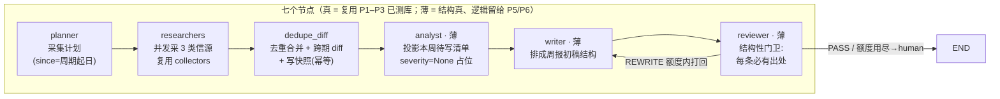

# 编排状态机 Orchestration（Phase 4）

> 交付沿革：Phase 1 = 数据模型 + 双后端持久化；Phase 2 = 采集层 Researchers（并发 + 单源失败隔离）；
> Phase 3 = Dedupe 去重合并 + Memory/Diff 跨期 diff。Phase 4 = **用 LangGraph 把 P1–P3 串成一条可跑的周期流水线**：
> `Planner → Researchers(并行) → Dedupe/Diff → Analyst → Writer → Reviewer`，一条命令出「周报初稿 + 门卫判定」。
> 本文先讲"为什么选状态机"，再给节点契约 / 共享 State / 门卫条件边 / 真值 trace，最后给局限。

---

## 1. 一张图看懂：编排状态机



LangGraph 是**图运行时、不是 LLM**：六个环节里大多数是纯 Python 节点（复用 P1–P3 已测逻辑），
只有 P5/P6 才需要在节点内部接 Mock/Qwen LLM —— 因此全 mock 下编排层也能被确定性测死（81 测试含 14 个编排测试）。

## 2. 为什么用"图状态机"而不是顺序脚本（面试讲这三点）

1. **共享可序列化 State 传数据**：节点函数契约是 `(state) -> 部分更新`，LangGraph 按 key 合并进同一份
   State（`PeriodRunState`，全部 JSON-safe 的 dict/list/str/int）。好处：State 可整体落盘（文件即状态）、
   可 checkpoint 断点续跑、每个 key 谁写谁读一目了然 —— 比 20 个函数手动传参/返回值接龙更不易漏。
2. **条件边让流程可循环、可中断、可人工介入**：Reviewer 门卫判 `REWRITE` 就沿条件边**回到 Writer 再写一次**，
   额度用尽判 `human`（转人工收件箱）而不是硬放行 —— "先审后发、低置信转人工"在编排层是**图的结构**，不是口头约定。
3. **节点边界 = 可插桩可替换**：每个节点独立可测；P5/P6 把薄节点内部做实，**图一条边都不用改**（依赖注入 ctx，
   测试还可 monkeypatch 单节点注入故障/坏输出验证门卫）。

对应工程可见物：`PeriodRunState` 定义了整条流水线的"数据契约"（新增一个中间产物 = 加一个 key）；
`route_after_review` 是唯一一条条件边；MemorySaver 按 thread_id(=run_id) 存每轮 checkpoint。

## 3. 七个节点契约

| 节点 | 读 State 关键 key | 做什么 | 写 State key | 真/薄 |
|---|---|---|---|---|
| planner | competitor_id / period / fetched_at | 算 since=周期起日、run_id、启用信源清单 | plan | 真（`orchestration/planner.py`） |
| researchers | plan | 每源一个 Worker 并发采（asyncio+信号量），单源失败进 failures 不中断 | collect_summary / cards | 真（复用 `collectors`） |
| dedupe_diff | cards | 只留落在本周期的卡 → `merge_to_events` → 与上期快照 `diff_event_sets` → 写本期快照（幂等） | events / changes / diff_summary / removed_fps / unchanged_fps / trace | 真（复用 `dedupe` + `memory.diff`） |
| analyst | changes | drop unchanged，投影"本周待写"清单，severity=None 占位 | write_items | **薄**（P5 rubric 分级） |
| writer | write_items / diff_summary | 排成周报初稿：headline + sections(adds/changes/removes) + items | draft | **薄**（P5 威胁雷达/对比表） |
| reviewer | draft / rewrites | 结构性门卫：每条有 evidence_urls + title + dimension；缺口 → REWRITE / human | gate / rewrites | **薄**（P6 grounding/矛盾/合规） |

> 数据流里的 pydantic 只出现在节点内部（转 model 用一下）；写进共享 State 的永远是 JSON-safe dict，
> 所以"State 可序列化"字面成立 —— `persist=True` 直接把最终 state 落 `data/pipeline/{run_id}.json`。

## 4. 共享 State 与 checkpoint

- `PeriodRunState`（`orchestration/state.py`）按"采集→记忆→写作→门卫"分段声明 key，全部可 JSON 序列化。
- 编译时挂 `MemorySaver()`：`run_id` 即 thread_id，`app.get_state(config)` 可取回某轮最终状态（测试已锁）。
- 记忆写档在 **dedupe_diff 节点内部**完成（`save_snapshot` 幂等覆盖同一 (竞品,期)），因此：
  单跑一个周期 = 冷启动（无上期 → 本期事件全 add）；要看到跨期"新增/变更/消失"必须先跑过上期写档 ——
  这正是 Snapshot（记忆）存在的意义，也是 `demo_two_weeks` 先 W34 后 W35 的原因。

## 5. 门卫与条件边：打回额度 / 转人工

Reviewer 不做语义判定（P6 才做 grounding/矛盾/合规），只做**结构性门卫**，三个缺口即打回：

1. 条目 `evidence_urls` 为空 → "无出处——先审后发要求每条可溯源"；
2. 标题为空；3. 缺观察维度 dimension。

判定流（`config.pipeline.review_max_rewrites=2`，测试锁死）：
`rewrites=0` 有缺口 → `REWRITE`（打回 Writer，rewrites=1）→ 仍有缺口 → `REWRITE`（rewrites=2）→ 还有缺口 →
`human`（转人工收件箱，**不自动放行**）。无缺口 → `PASS`。"本周无变更"（diff=0 → items 空）也是合法 PASS，不是失败。

## 6. trace 真值实例：N 采 → M 并 → K diff（实测，非编造）

跑 `demo_two_weeks()`（`uv run pytest tests/test_orchestration_graph.py` 同样锁死这些数）：

| 竞品 | 周期 | collected N | merged M | diff K | 语义 | gate |
|---|---|---|---|---|---|---|
| crm_alpha | W34（冷启动） | 2 | 2 | 2 | 无上期快照 → 全新增 | PASS |
| crm_alpha | W35（对上期） | 5 | 3 | 3 | 5 卡并成 3 事件；v12.0 发布会官网+rss+媒体 **3 出处并入 1 条**；diff 出 3 | PASS |
| bi_beta | W34（冷启动） | 2 | 2 | 2 | 全新增 | PASS |
| bi_beta | W35（对上期） | 5 | 4 | 4 | 5 卡并成 4 事件（图表库 3.0 双源并入一） | PASS |

- **M < N 是去重在省**（第二期 5→3 / 5→4）；**diff ≤ merged**（第二期 W35 diff 出的是真"变化"，重跑同周期 diff=0）。
- 注：W35 卡数含增量抓取可能带回的未来内容，dedupe_diff 用 `period_start ≤ 发布日 < period_end` **严格只留本周期**。

## 7. 运行方式

```bash
uv sync                     # 依赖（含 langgraph）
uv run pytest               # 全绿（Phase 4 = 81，编排新增 14 条）
uv run python -c "from orchestration import demo_two_weeks; demo_two_weeks()"   # 两竞品×两期回放，打印 trace+gate
uv run python -c "from orchestration import run_cycle; r = run_cycle(persist=True); print(r['gate'])"
# 最终 state 落 data/pipeline/{run_id}.json（文件即状态 → P7/P8 审计/回放对象）
```

## 8. 测试（tests/test_orchestration_graph.py，14 条）

| 族 | 锁什么 |
|---|---|
| 周期换算 | period_start/period_end_exclusive/default_fetched_at（2026-W34=08-17…），非法期 fail fast |
| 冷启动 / 真 diff / 幂等重跑 | W34 全 add；W35 对上期 5→3→3 且 v12 事件 evidence_urls=3、快照已写档；重跑同周期 diff=0 |
| 状态机属性 | 最终 state 链 key 齐全且 `trace.diff==len(changes)`；checkpointer 可取回最终判定；两独立底库同输入同结果（确定性）；persist 落盘 |
| 门卫 + 条件边 | 干净→PASS；缺出处额度内 REWRITE、用尽→human；route REWRITE→writer 其余→END；**注入坏 writer → 打回 2 次 → human** |
| 失败隔离在编排层成立 | 单源 boomed 不 raise、failures 记 `rss/crm_alpha`、健康源照常产出（collected 5→3、merged 2）、仍 PASS |

## 9. 局限与边界（诚实口径）

- **Analyst / Writer / Reviewer 本期是"结构真、逻辑薄"**：威胁分级 rubric、周报威胁雷达/对比表、语义 grounding /
  矛盾 / 合规检测分别在 **Phase 5 / Phase 6** 做实 —— 图与 State 已铺好挂载点（severity=None 占位、gate 判定已接）。
- 语义近并（embedding/Qdrant）仍未做：近原文去重仍走确定性规则（见 [`docs/memory.md`](memory.md) 边界表）。
- 单次 `run_cycle` 若上期无快照 = 冷启动（全 add）；跨期语义必须"先跑过上期写档"才能成立。
- Reviewer 只做结构完整性（有出处/必填齐全），**不**证明原文支撑结论 —— 那是 P6 的 grounding，别把 P4 说成已审稿。

---

_更新日志_：2026-09-03 建（Phase 4 交付）。
