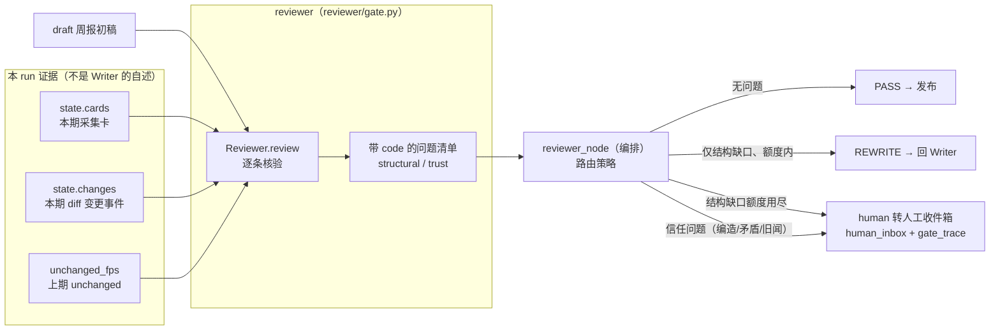

# Reviewer 审稿门卫（Phase 6）

> Phase 6 交付：把 Reviewer 从 Phase 4/5 的"**结构门卫**"做实为"**审稿门卫**"——README2 §5.8 / §7.4 row 6 落地。
> 三条判定：**grounding（来源支撑度）** + **矛盾检测** + **口径/结构合规**；并给
> **打回闭环**（结构性缺口 REWRITE 限次）+ **人工收件箱**（信任类问题直转 human，人工确认才放行）。
> 验收（README2 §7.4 row 6）：**注入假事件能被门卫拦下（不进 PASS 可发布态），打回有 trace**。
> 判定机器与路由都在本期可测死（123 测试全绿，含 13 条 reviewer gate 测试）。
> 编排状态机整体图见 [`docs/orchestrator.md`](orchestrator.md)，周报/分级口径见 [`docs/analyst_writer.md`](analyst_writer.md)。

---

## 1. 一张图看懂：Reviewer 是"问题清单生成器"，路由在编排节点



Reviewer **包只产出问题，不判 verdict**：`reviewer/gate.py::Reviewer.review()` 是纯核验者，
返回 `list[ReviewProblem]`；REWRITE 阶梯 / 直转 human 是 `orchestration/nodes.py::reviewer_node`
的路由。拆开的好处：门卫逻辑可单测锁死，路由策略单独可测（且将来改路由不动门卫）。

## 2. 三个判定，各自"能确定性做到哪一步"（诚实分层是本章主线）

### 2.1 grounding（来源支撑度）= 闭环自证，不假装"读原文语义"

README2 §5.8 要 reviewer 判"每条结论能否回溯 ≥1 URL 且**原文真能支撑**结论"。本引擎离线优先，
不做假语义，于是把 grounding 拆成**三层确定性自证**（docs/architecture 的分水岭叙述里，P6 前的
"结构门卫"缺的就是这些）：

| 代码 | 检查 | 抓什么 |
|---|---|---|
| `UNSOURCED_URL` | 每条 `evidence_url` 必须 ∈ 本期采集卡 URL 集合（state.cards） | **编造 URL**（指向从没抓过的源） |
| `UNGROUNDED_FP` | 每条 `fp` 必须 ∈ 本期 diff 变更事件 fp 集合（state.changes） | **凭空 fp**（声称的"变更"diff 根本没产出） |
| `UNGROUNDED_CLAIM` | 理由里"命中信号词：X"的 X 必须真出现在条目正文（title+summary） | **张冠李戴**（给"发布"动态挂"降价"理由） |

第 1、2 条让**结论可回溯**（先审后发的地基：发出去的每条都能点回本 run 真采到的原文）；
第 3 条让**结论可复核**（理由不是空话，声称命中的信号词确实在讲这件事）。

**明确不做（诚实边界）**："原文明说了、还是我脑补的"这种**读语义**核对，需要 LLM 语义层
（provider-gated，Mock 顶不了真语义），本期不接、不假装 —— 见 §7 局限。

### 2.2 矛盾检测（确定性子集）：显式反义极性 + 共享主体锚

只抓**能确定的机械冲突**：同竞品本期两条变更，正文各命中一个**反义极性词**（同轴、方向相反：
涨价↔降价 / 上调↔下调 / 让利↔涨价 / 正式发布↔停止支持…），且**共享主体锚**（同一版本号
v12.1，或共享 ≥3 个字符二元组）→ 判 `CONTRADICTION`，**转人工复核，不自动二选一**。
`POLARITY_AXES`（`reviewer/gate.py`）是显式小表：价格方向 / 上线-下线状态两轴。

为何必须"主体锚"：同竞品本周"A 产品涨价 + B 产品降价"是合法商业动作，不矛盾；
"同一版本既上调又降价"才互斥 —— 锚就是用来挡第一种误报的。

### 2.3 口径/结构合规

P5 的 `WeeklyReport` schema 已强制结构合规（每条 severity/理由/出处非空、headline/雷达/kind 自洽，
见 docs/analyst_writer.md）；P6 在 Reviewer 补一条 README2 §5.8 点名的**"与上期重复"**：

| 代码 | 检查 | 抓什么 |
|---|---|---|
| `DUPLICATE` | 条目 `fp` ∈ 本期 `unchanged_fps` | 下游把**上期就报过的旧闻又发出来**（diff 已把 unchanged drop，出现即下游 bug/编造） |

## 3. 问题代码总表（problems.py：code 是机器可判的契约）

| code | 类型 | 触发 | 路由 |
|---|---|---|---|
| `NO_EVIDENCE` | 结构 | evidence_urls 空（无出处） | REWRITE → 用尽 → human |
| `EMPTY_TITLE` | 结构 | 标题为空 | REWRITE → 用尽 → human |
| `MISSING_DIMENSION` | 结构 | 缺观察维度 | REWRITE → 用尽 → human |
| `MISSING_SEVERITY` | 结构 | 未分级（缺 severity） | REWRITE → 用尽 → human |
| `EMPTY_REASONS` | 结构 | 无威胁判定理由 | REWRITE → 用尽 → human |
| `MISSING_FP` | 结构 | 缺身份 fp（回溯锚都没有） | REWRITE → 用尽 → human |
| `UNSOURCED_URL` | 信任 | 出处不在本期采集卡（编造 URL） | **直转 human** |
| `UNGROUNDED_FP` | 信任 | fp 不在本期 diff 变更集（凭空 fp） | **直转 human** |
| `UNGROUNDED_CLAIM` | 信任 | 理由命中词不在正文（张冠李戴） | **直转 human** |
| `CONTRADICTION` | 信任 | 同竞品两条反义 + 同主体（互斥存疑） | **直转 human** |
| `DUPLICATE` | 信任 | fp 属上期 unchanged（旧闻重发） | **直转 human** |

## 4. 路由策略：REWRITE 只修结构，修不了信（三条铁律）

1. **结构性缺口（格式病）→ REWRITE 阶梯**：额度 `config.pipeline.review_max_rewrites=2`
   （打回 Writer 重写，最多 2 次）；用尽仍缺 → human。这是 Phase 4/5 就有的条件边
   （reviewer →(REWRITE)→ writer）。
2. **信任类问题 → 直转 human，不消耗改写额度**：让 Writer"改写"一个没出处的结论 = **逼它编造**。
   诚实动作是立即拦截 + 进人工收件箱，比空转 2 次更省也更对（测试锁：`rewrites` 停在 0）。
3. **信任 + 结构同时出现 → 信任优先**（直转 human）：结构问题在"这条本来就不可信"面前没有
   先修的价值（测试锁：`test_trust_beats_structural_routing_human_not_rewrite`）。

为什么"先审后发、转人工"在编排层是**结构**不是口头约定：human → END 即**不发布**；
人工收件箱（`human_inbox`）+ 打回审计迹（`gate_trace`）是可见产物 —— 一条被拦的假事件，
一定能在 `gate_trace` 里看到它被哪条 code 拦的、在 `human_inbox` 里看到它等谁确认。

## 5. 审计迹与人工收件箱（README2 §5.8 打回有 trace 的载体）

- `state.gate_trace`：**每次门卫判定 append 一条** `{attempt, verdict, problems[], reasons[]}`
  —— REWRITE 打回几次、最后到哪，全留痕；PASS 也留（"这期审过且干净"也是审计事实）。
- `state.human_inbox`：verdict=human 时，把问题条目落箱
  `{competitor_id, period, item_index, fp, code, detail, attempts}` —— 人工打开就是"待确认清单"，
  Phase 7 面板/人工确认接口直接读它。

## 6. 决策 why（面试讲这几点）

1. **为什么 grounding 用"闭环自证"而不是接 LLM 读原文**：无 key 离线要可回归；
   而"结论是否被原文支撑"的最小充分条件是——**来源是本期真采的、身份是本期真 diff 的、
   理由命中的词真在正文**。这三点确定性锁死后，"真事件 + 编造 URL"、"凭空事件 + 真 URL"、
   "给发布挂降价理由"三种最常见的编造入口全被堵；剩下"原文没明说、我脑补"是语义问题，留给
   真 provider 的语义层（诚实标注，不假装）。
2. **为什么信任问题不走 REWRITE**：REWRITE 是"格式病重写一遍"，Writer 没有能力（也不该）
   给一条没出处的结论"补出"出处 —— 让它重写只会产出**更顺滑的编造**。所以信任问题直转人工，
   让人类判断"这条要不要、上哪核实"。这也是为什么 P5 周报 Writer **只组装、绝不补充常识**。
3. **为什么矛盾"宁转人工"不自动二选一**：两条互斥动态谁对谁错需要外部事实（哪个版本号是真的），
   自动保留一条 = 擅自丢弃信息。所以 `CONTRADICTION` 只是**提示**，进人工收件箱。
4. **为什么门卫要独立于 Writer 实现**：`writer` 包不依赖 `reviewer`，Reviewer 的判定依据是
   **本 run 的证据**（cards/changes/unchanged_fps），不是 Writer 产出的自述 —— 否则就是
   "自己审自己"。注入测试正是从 Writer 边界塞坏数据验证门卫独立拦得住（`test_graph_injected_fake_item`）。

## 7. 局限与边界（诚实口径，别把 P6 说成全语义审稿）

- **grounding 不做"读原文语义"**："原文明说 vs 暗示"的深层核对要 LLM 语义层（provider-gated，
  Mock 顶不了），本期未接。P6 的 grounding = 来源可回溯 + 结论可复核，不是"逐页语义核对"。
- **矛盾只抓显式反义极性 + 主体锚**：语义级委婉互斥（话术相反但词面不同）不判 →
  人工收件箱兜底。**宁宽勿漏**：机械规则可能把"本不互斥但词面对上"的误转人工 ——
  这是刻意选的保守方向（人工确认成本 < 漏报一条假情报的成本）。
- **分级篡改不在本期拦截范围**：若 Writer 把 high 静默改成 low 但**不改理由、不改正文**，
  现有三条信任检查都拦不住（要拦需 Reviewer 独立重跑 rubric 或 LLM 复核分级）——记为后续增强。
- **READEME2 里"编造动态拦截率 92%"是设计目标占位、从未实测，绝不上简历/文档实测数**。
  本期给的实测口径是注入式测试：6 类注入模式（编造 URL / 凭空 fp / 理由张冠李戴 / 反义矛盾 /
  旧闻重发 / 图级注入假 URL）**全被拦截（6/6）**，真实 fixtures W35（crm 3 + bi 4 = 7 条目）**0 误拦**。
- 主体锚用版本号 / 二元组近似：两条真矛盾若**都无版本号且措辞相距远**（共享二元组 <3）会漏 →
  仍由"转人工 + 后续语义层"兜底。

## 8. 运行与验证

```bash
uv sync                        # 依赖已含
uv run pytest                  # 全绿（Phase 6 = 123，其中 reviewer gate 13 条）
uv run pytest tests/test_reviewer_gate.py -v   # 看每类注入如何被拦
# 全链演示（两竞品 × 两期，gate 全 PASS + gate_trace/human_inbox 审计字段）：
uv run python -c "from orchestration import demo_two_weeks; demo_two_weeks()"
```

实测口径（注入式，可复现，测试锁死）：
| 注入 | 门卫判定 | 证据 |
|---|---|---|
| 编造 URL（真 fp 拼假 URL） | human（`UNSOURCED_URL`） | test_grounding_unsourced_url / test_graph_injected_fake_item |
| 凭空 fp（真 URL 拼假 fp） | human（`UNGROUNDED_FP`） | test_grounding_ungrounded_fp |
| 理由张冠李戴（正文无"降价"却挂降价理由） | human（`UNGROUNDED_CLAIM`） | test_grounding_claim_word_mismatch |
| 同版本一上调一降价 | human（`CONTRADICTION`） | test_contradiction_opposite_same_version |
| 与上期 unchanged 重复 | human（`DUPLICATE`） | test_duplicate_vs_unchanged |
| 真实语料 W35（crm/bi 7 条目） | **PASS（0 误拦）** | test_reviewer_real_w35_clean_no_false_positive |

---

_更新日志_：2026-09-04 建（Phase 6 交付：reviewer 包做实 = grounding 闭环自证 + 反义极性矛盾 + 与上期重复，
typed problems + 路由策略 + gate_trace/human_inbox；123 测试）。
