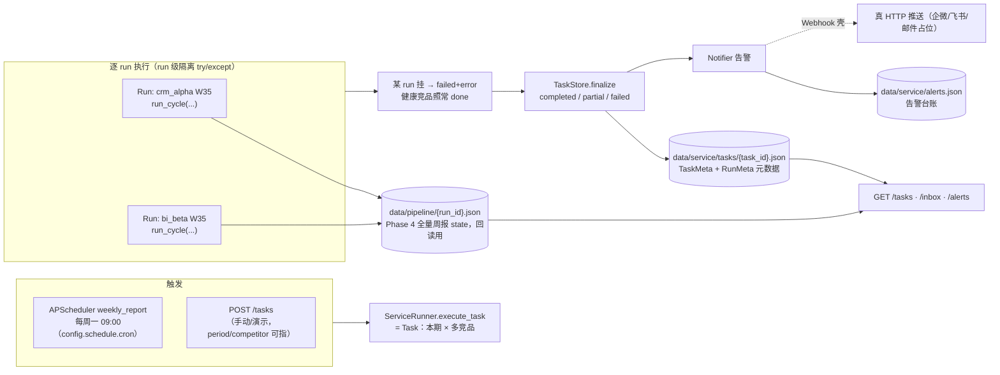

# 服务层：任务 / 定时 / 告警 / 健壮性 + 人工放行闭环 / 发布视图 / 简单面板 / 跨竞品横向对比（Phase 7+8 + 增量）

> Phase 7 交付（README2 §5.9 定时与告警 + §5.10 服务层健壮性与观测 / §7.4 row 7）：
> 把 Phase 4–6 已跑通的单条流水线（`run_cycle`），包成**一次"本期巡检" = 一个 Task** 的服务层
> —— FastAPI **任务管理**（POST /tasks → 同步执行 + 返回终态）、**APScheduler 定时**（每周一 09:00
> 报上周）、**告警 webhook 适配**（Mock 台账离线可查，Webhook 壳诚实占位）、**run 级失败隔离**
> （一竞品挂不影响其它）、**trace 计数链收口**（采集 N → 去重 M → diff K → 门卫拦 X 在服务层可查）。
> Phase 8 补（README2 §5.11 / §7.4 row 8）：把 P7 停在"拦到等人工"的先审后发推到底——
> **人工放行闭环**（`service/publish.py`：release/dismiss 销案、note 只备注）+ **发布视图**
> （`published_view` 把周报 draft 按 resolution 过滤成 published/held/dismissed）+ **简单面板**
> （`app/routers/panel.py` 零构建 HTML：放行/驳回/备注按钮 + 发布视图 + 告警可视化）。
> 验收：接口全套 + 定时/告警可演示 + 故障演练（P7）+ 人工闭环/发布过滤/面板可演示 + 评测门禁（P8）。
> 增量「跨竞品横向对比」（README2 路线图之后，自主增量）：在 Phase 8 发布视图之上加**横着看**——
> `compare/` 纯函数（已放行条目按 dimension 轴对齐，**维度对齐 ≠ 实体对齐**）+
> `service/compare.py`（compare_view）+ `GET /tasks/{id}/compare`（<2 家已放行 422）+ 面板横向对比段。
> **180 测试全绿**（144 基线 + eval 15 + panel API 6 + 横向对比 15：`tests/test_compare_{builder,api}.py`）。
> 编排与门卫内部口径见 [`docs/orchestrator.md`](orchestrator.md) / [`docs/reviewer.md`](reviewer.md)，
> 评测口径见 [`docs/eval.md`](eval.md)，横向对比口径见 [`docs/compare.md`](compare.md)。

---

## 1. 一张图：一次"本期巡检"如何被建、跑、存、查



- **Task = 一次被调度/手动的"本期巡检"**（period × competitors[]）；**Run = 单次 run_cycle**
  （竞品 × period）。Task 聚合 Run：`TaskStatus` = running → completed / partial / failed；
  `RunStatus` = pending / running / done / failed。
- **两层存储分开**：TaskStore 只存元数据（`data/service/tasks/{task_id}.json`，文件即状态、
  原子写 `.tmp`+`os.replace`）；每 run 的**全量周报 state** 仍在 Phase 4 的
  `data/pipeline/{run_id}.json` —— 报告路由（GET /tasks/{id}/report）从这里合并回 draft。
  不把大对象塞进 Task 文件 = 列表/详情查询轻，审计留痕与回放对象分离。

## 2. 对象与存储（service/schemas.py + service/store.py）

| 对象 | 含义 | 关键字段 |
|---|---|---|
| `TaskMeta` | 一次巡检 | task_id / period / competitors_requested / status / runs[] / created_at / finished_at / summary（聚合 done/failed/human/inbox + chains）/ error |
| `RunMeta` | 单次 run_cycle 的查询视图 | run_id / competitor_id / period / status / **verdict** / **trace** / diff_summary / **threat_radar** / gate_problems / gate_trace_count / inbox_count / human_inbox / error / started_at / finished_at |
| `AlertEvent` | 一条告警 | alert_id / event_type（high_threat · human_inbox · run_failed）/ competitor_id / period / run_id / summary / payload / ts / delivered_by（mock · webhook_placeholder） |

`TaskStore.create_task → add_run（同 run_id 幂等覆盖）→ finalize` 一次跑完一条链路；
`list_tasks()` 按 created_at 倒序，**损坏/半截文件读取层容忍跳过**（审计台账以可读为准）。
告警台账 `data/service/alerts.json` 数组 + 原子写。同 (竞品, 期) 重跑 = 新 task_id + 新 run_id →
两个 Task 文件并列 = 审计留痕（服务层关心"每次调度都发生过什么"，不幂等覆盖；
幂等覆盖是 Phase 1 memory 写快照的职责）。

## 3. trace 计数链收口（README2 §5.10 "采集 N → 去重 M → diff K → 门卫拦 X"）

每个 done 的 Run 把最终 State 里的计数**抄进 RunMeta**，一次巡检的 summary 再聚合出 `chains`：

```jsonc
// GET /tasks 返回的 summary.chains[0]
{
  "competitor_id": "crm_alpha",
  "trace": {"collected": 5, "merged": 3, "diff": 3},   // N → M → K（Phase 2/3 埋，服务层收口）
  "verdict": "PASS",
  "gate_problems": 0,                                    // 门卫拦的问题条数
  "inbox": 0                                             // 人工收件箱条数
}
```

于是"采集多少 → 并掉多少 → diff 出几条变更 → 门卫拦了几条 / 转人工几条"在 HTTP 层一眼可查，
不再需要翻 pipeline json。实测口径（fresh-store W35，非编造，测试锁死）：crm **5→3→3**、
bi **5→4→4**；威胁雷达 crm {high1, med1, low1}、bi {high1, med1, low2}，各项之和 == diff K。

## 4. 告警语义 + Notifier 抽象（service/notifier.py）

| event_type | 何时触发 | 说明 |
|---|---|---|
| `high_threat` | 门卫 **PASS** 且威胁雷达 `high>0`（`schedule.alert_on_high_threat=True` 缺省） | "高威胁不等周报即时提醒"：真实 W35 有 high → 每竞品一条 |
| `human_inbox` | 门卫 **verdict=human** | 转人工收件箱（先审后发的告警出口） |
| `run_failed` | 该 run `run_cycle` 抛异常 | 失败告警（run 级隔离的可见信号） |

`Notifier` 是接口：`MockNotifier`（**默认**，`make_alert → append_alert` 落台账，离线可演示）；
`WebhookNotifier`（配置 `alerts.webhook_url` 非空时启用）——**空 url 构造即 ValueError（fail-fast，
不许静默退化不发）**，`deliver` 抛 `NotImplementedError`（诚实占位：真 HTTP 推送接企微/飞书/邮件时
在这实现；服务端收到 NotImplemented 回 501，不假装已发）。告警失败绝不拖垮巡检（runner 捕获跳过）。

## 5. 定时口径（service/scheduler.py + runner.last_completed_iso_week）

- cron 由 `config.schedule.cron` 给出，注册成 APScheduler `weekly_report` job（不 start 不真等）；
  job 内容 = `run_now(ctx)` —— **调度与执行解耦**：APScheduler 只负责"到点叫你"，真正跑的是 runner。
- `last_completed_iso_week(today)`：报"**最近一个已结束的 ISO 周**"——`今天 − (weekday+7) 天` 到那周的
  周一，取其 ISO 年/周号。周一 09:00 cron 触发时正好报上周（例：2026-09-04 周五 → **2026-W35**；
  2026-09-07 周一 → **2026-W36**）。与 Phase 4 `Planner.default_fetched_at`（周期结束后的周一 09:00）
  对齐 → 同 period 同输入即同结果，回放确定性。
- `schedule.enabled` 缺省 `false`（main lifespan 只在 true 时 start，离线测试不碰调度线程）。

> **口径坑（实测锁死，别改回去）**：APScheduler 的 `CronTrigger` 数值 day-of-week 是 **0=周一、最大 6**
> —— 与标准 cron（1=周一、0=周日）不同。故 config 用名字 `"0 9 * * mon"` 免歧义；若改成 `"0 9 * * 1"`
> 会真触发到**周二**。`test_weekly_cron_fires_monday_0900` 从 config 读值 + 走真注册路径断言下个触发点
> = 每周一 09:00，防静默漂移。

## 6. HTTP 接口（app/routers + main 0.9.0，Phase 7+8 + 增量）

| 方法/路径 | 作用 | 返回 |
|---|---|---|
| `POST /tasks` | 建 Task 并**同步执行**（period 缺省 = 最近已结束 ISO 周；competitor_id 可单竞品调试；未知竞品 404） | 201 + TaskMeta（计数链 + 门卫判定） |
| `GET /tasks` | Task 列表（created_at 倒序） | count + tasks[] |
| `GET /tasks/{id}` | Task 详情（404 = 不存在） | TaskMeta |
| `GET /tasks/{id}/report` | 合规周报：各 done run 从 pipeline json 合并全量 draft（headline/sections/items/sources + threat_radar + trace） | report[] |
| `GET /tasks/{id}/published` | **发布视图（Phase 8）**：把周报 draft 按人工 resolution 过滤成 published / held / dismissed（先审后发闭环的可复核快照，逻辑在 service/publish） | published_total/held_total/dismissed_total + runs[] |
| `GET /tasks/{id}/compare` | **跨竞品横向对比（增量）**：消费发布视图，把 ≥2 家有已放行条目的 run 按 dimension 轴对齐（维度对齐≠实体对齐，逻辑在 compare/ + service/compare）；task 不存在 404、<2 家已放行 422 + reason | CrossCompareReport（competitors/rows/both_moved_dims/single_moved_dims/first_move_counts） |
| `GET /inbox` | 人工收件箱：**只有 verdict=human 的 run** 的 human_inbox 条目；`?status=pending\|all\|resolved`（缺省 pending = 只看未处理）；每条带稳定 `entry_id = {run_id}#{seq}` | count + status_filter + entries[] |
| `POST /inbox/resolve` | **人工定案（Phase 8）**：{entry_id, action: release\|dismiss\|note, by, note?} → release/dismiss = 销案终态、note = 只备注不销案；404 未知条目、409 已定案不可覆盖、422 格式/字段非法 | resolved + entry（含 status + resolution） |
| `GET /alerts` | 告警台账倒序（最新在前） | count + alerts[] |
| `POST /alerts/hook` | 手动投递演练（body=event_type/summary/…；非法 event_type 422） | accepted 回执 |
| `GET /panel` | **简单面板总览（Phase 8）**：人工收件箱待办（未销案条目 + 跳转）+ 最近任务 + 最近告警（HTML） | text/html（空态 200） |
| `GET /panel/task/{id}` | **单任务面板（Phase 8）**：每 run 收件箱条目带 放行/驳回/备注 按钮（fetch POST /inbox/resolve）+ 发布视图；404 缺任务 | text/html |

`main.py` 挂 `app.state.service = build_service_context()`（settings + TaskStore + Notifier + Runner
捏成一个依赖）；routers 经 `get_service_ctx` 读。`schedule.enabled=true` 时 lifespan 启动 scheduler。
版本 `0.9.0`。健康检查 `/health` 保持 Phase 0 契约不变。

### Phase 8 补：resolution 语义 / 发布视图 / 简单面板（service/publish.py）

- **resolution 语义**：收件箱条目 `status` 由 resolution 推导——无 → pending；`note`（只备注不销案）→ 仍
  pending；`release` / `dismiss` → resolved（**终态不可覆盖**，改判同一条目 409，不许覆盖审计决定）。
  resolution 审计字段 `{action, by, note, resolved_at}` 原样落回 `run.human_inbox[seq]`（`add_run` 幂等覆盖），
  → 面板/发布视图读 TaskStore 就能看到"谁、何时、为何定案"。
- **发布视图 `published_view(task_store, settings, task_id)`**：每 done run 从 pipeline json 读 draft，把每条
  item 按 item_index 映射到 human_inbox 条目的 resolution：
  - 无任何指向（**自审通过**）→ 直接进 published（`human_released=false`）；
  - 有 release → 进 published（`human_released=true` + resolution 原文）；
  - 有未定案/只有 note → 挂 held（等人工）；
  - 有 dismiss → 从发布剔除、进 dismissed 审计区。
  真实 PASS run = 全自动发布（held/dismissed 空）；真实 human run = 门卫拦到等人工 → published_view 把
  "拦了什么、放行后发什么"变成一屏可复核的决策快照。
- **简单面板**（零构建，不引前端框架/打包器）：服务端直出 HTML + 原生 JS，**只做"把 service 层 JSON 渲染成
  HTML + 点按钮调回同款 JSON API"**，路由薄、逻辑全在 `service/publish` + TaskStore。测试只断言 200 + 关键
  文本标记（待办/entry_id/发布视图/放行按钮），不测浏览器行为。

### 增量补：跨竞品横向对比（service/compare.py + compare/，详见 docs/compare.md）

- **compare_view(task_store, settings, task_id)**：调 published_view 只取各 run **已放行（published）** 条目 →
  过滤出 ≥1 条已放行的 run → 映射 `CompetitorView` → `compare.builder.build`。先审后发纪律延续到对比层：
  被门卫转人工、仍挂起（held）或人工驳回（dismissed）的条目不进横向视图——不会拿"审后剔除的假货"误导横向判断。
- **为什么横向对比的输入是发布视图而不是全量 draft**：横向视图面向"已确认能发出去的内容"，假事件在人工关就应
  被掐断；放行后剩下的才是可以横着比的东西。
- **422 的诚实边界**：<2 家有已放行条目的竞品 → `CompareNotPossible`（路由 422 + reason）——单竞品 / 全挂起 /
  全剔除则没有"横向"可言，宁可明说不比，不硬凑一份单边报告。
- **确定性**：输出 = `build(发布视图)` 的纯派生 JSON，不落盘、不带时间戳（generated_at=None）→ 同状态同输入
  逐字节相等（HTTP 重复 GET 可复测，`tests/test_compare_api.py` 锁死）。
- **对齐语义**（灵魂，面试必讲）：维度对齐 ≠ 实体对齐；first_mover 比同维度最早 first_seen（同日并列、单边独占
  即它、无日期证据 orderable=False 不断言）；高威胁条数并列呈现不跨竞品排危险序。

## 7. 健壮性：run 级失败隔离 + 故障演练

`execute_task` 对每个竞品**各自 try/except**：某竞品 `run_cycle` 抛错 → 该 Run 记 `failed + error` +
`run_failed` 告警，**其余竞品照常出结果**（Task 终态 partial）——这是 Phase 2 采集层"源级隔离"
在服务层的升级（README2 §5.10 服务层健壮性）。

两条故障演练测试（monkeypatch 注入，非真实故障）：
- **演练 A（run 级隔离）**：patch `service.runner.run_cycle` 对 `crm_alpha` 抛 RuntimeError →
  crm failed+error、bi 照常 done+PASS、Task=partial、`run_failed` 告警 1 条
  （`test_fault_drill_run_level_isolation`）。
- **演练 B（注入假事件延伸到服务层）**：patch `graph.NODE_IMPLS["writer"]` 返回"真 fp 拼编造 URL"的
  条目（复用 Phase 6 `test_graph_injected_fake_item` 手法）→ 门卫 human 拦下、Task 正常执行完但
  `inbox_count=1`、`UNSOURCED_URL` 落人工收件箱、`human_inbox` 告警 1 条 —— **假事件绝不会以
  "零收件箱地 completed"蒙混过关**（`test_fault_drill_bad_writer_human_inbox_and_alert`）。

## 8. 决策 why（面试讲这几点）

1. **为什么 Task/Run 两层，且 TaskStore 只存元数据**：一次巡检挂了半个竞品，你要能问
   "谁成功了、谁失败了、计数链怎样"，而不是整单作废或翻大 JSON；全量 draft 留 pipeline json，
   报告路由按 run_id 回读 —— 列表/详情查询保持 O(小)。
2. **为什么同一 (竞品,期) 重跑不幂等覆盖**：服务层是**调度审计**视角——每次 cron 触发都应该留痕；
   "同一份数据别重复存"是 Phase 1 memory 写快照的职责。两层语义不同，接口天然不同。
3. **为什么 APScheduler 只"到点叫你"**：job 主体就是 runner.run_now，调度与执行解耦 → 手动触发
   （demo/测试）与定时走同一条 execute_task 路径，不用真等周一也能验证口径。
4. **为什么 Webhook 空 url 要 fail-fast、deliver 要抛 NotImplemented**：告警是最容易"静默坏掉"的
   环节 —— 配了 url 却不发 = 假安全感。宁可构造期报错、投递期 501，也不假装已推送给老板。
5. **为什么 run 级隔离而不是"整单原子"**：竞品独立巡检，一个源挂了整个 Task failed 会掩盖
   健康竞品的高威胁信号（那正是要告警的东西）。partial + 逐 run 状态是最小诚实呈现。
6. **为什么 release/dismiss 终态不可覆盖、note 只备注不销案**：人工定案是**审计事件**，改判 = 覆盖审计记录
   （409）；备注是"还想再想想"的中间态，不该把"我还没定"悄悄算成"已放行"——发布视图宁挂 held 也不误发。
7. **为什么横向对比吃"已放行条目"且维度轴对齐不碰实体**：横向视图是给"已确认可发内容"做横着比的，假条目在
   人工关就被掐，不让它进对比误导判断（先审后发纪律延续）；`dimension` 是共享枚举，对齐只到维度轴——
   "A 的 v12 == B 的图表库 3.0"要实体级等价（语义/embedding，更后续），本层不发明同一竞赛的假象；
   无 first_seen 日期证据宁可不说先后（orderable=False），severity 只并列不跨竞品排危险序。

## 9. 局限与边界（诚实口径，别把 P7/P8 说成生产级平台）

- **Webhook 仍是占位壳**：企微/飞书/邮件推送未接真 HTTP（需要真实 endpoint/密钥，属接入期）；
  保证的是**适配层 + fail-fast + 不假装已发**。Mock 台账是离线的诚实默认。
- **定时只在进程活着时生效**：单进程长跑服务定位；无持久任务队列/错过补偿（README2 未承诺）。
- **同步执行**：POST /tasks 在请求内跑完多竞品才返回（演示直观、curl 就能看终态）；
  超长任务 / 并发限流仍未做（任务队列可接）。
- **"人工放行"是审计动作，不是真订阅分发**：release 让条目进 published_view（HTTP 查询态的可复核快照）；
  周报**对外真推送仍无渠道**（那是接入期活，Reporter/publisher 占位）。面板是"能点按钮、能看到决策"的
  操作台，别指望它好看——这是诚实口径不是产品宣言。
- **评审评测是固定语料回归基线**：Eval-Harness 的数字（gold 7/7、对抗 6/6 等）只证明"造的固定场景里流水线
  稳定做到设计该做的"，**不是真实世界表现**（详见 docs/eval.md §6）；P7 的 trace/radar 数字为实测（非编造）。
- **README2 里的目标指标（如告警延迟、覆盖率）仍是设计目标占位**；本期实测口径只有上面测试锁死的部分
  （service 21 + panel 6 + eval 15 + compare 15 条）。
- **横向对比不做实体对齐**：GET /tasks/{id}/compare 的 first_mover 是"该维度本期动作时间先后"（维度对齐），
  不宣称 A 的某功能 == B 的某功能；实体级等价需语义实体解析 / embedding（更后续，不上简历）。single_moved 是
  "只有一家动"的事实陈述，不自动译成"对方是盲点"。severity 只并列计数（docs/compare.md §3/§8）。

## 10. 运行与验证

```bash
uv sync
uv run pytest                       # 全绿（Phase 8 + 增量 = 180：基线 144 + eval 15 + panel 6 + compare 15）
uv run pytest tests/test_service_runtime.py tests/test_service_api.py tests/test_panel_api.py tests/test_compare_api.py -v
uv run uvicorn app.main:app --port 8000   # 服务化 HTTP（0.9.0，含 /panel）
# 跑一次"本期巡检"（单竞品调试 / 缺省 = 全部竞品 + 最近已结束 ISO 周）：
curl -s -X POST localhost:8000/tasks -H 'Content-Type: application/json' -d '{"period":"2026-W35","competitor_id":"crm_alpha"}'
curl -s localhost:8000/tasks                 # 任务列表（含 trace 计数链 + 门卫判定）
curl -s localhost:8000/tasks/<task_id>/report # 合规周报全量 draft
curl -s localhost:8000/tasks/<task_id>/published   # 发布视图：published/held/dismissed（PASS run = 全发布）
curl -s localhost:8000/tasks/<task_id>/compare     # 跨竞品横向对比（feature 双动 + bi 先动 + market 单边；单竞品 422）
curl -s localhost:8000/inbox                 # 人工收件箱（PASS 时为空；?status=all|resolved 可切）
curl -s localhost:8000/alerts                # 告警台账（真实 W35 有 high → high_threat）
curl -s -X POST localhost:8000/alerts/hook -H 'Content-Type: application/json' \
     -d '{"event_type":"high_threat","summary":"手动投递演练"}'
curl -s -X POST localhost:8000/inbox/resolve -H 'Content-Type: application/json' \
     -d '{"entry_id":"<run_id>#<seq>","action":"release","by":"演示员","note":"人工核对无误"}'  # 人工放行
# 简单面板（浏览器打开 / 或 curl 看 HTML）：
curl -s localhost:8000/panel                  # 总览：待办收件箱 + 最近任务 + 最近告警
curl -s localhost:8000/panel/task/<task_id>   # 单任务：放行/驳回/备注按钮 + 发布视图
```

实测口径（fresh-store W35，测试锁死，非编造）：crm **5→3→3**、bi **5→4→4**；雷达 crm {1,1,1} /
bi {1,1,2}；全 PASS、收件箱空、gate_trace=1；每竞品触发 1 条 high_threat 告警；发布视图 = 全自动发布
（published 3+4、held/dismissed 0）。演练 A（run 挂）→ Task partial + run_failed 告警；演练 B（注入假事件）→
human + inbox + human_inbox 告警，`POST /inbox/resolve` release → 该条目从 held 进 published（human_released=true）、
dismiss → 进 dismissed 审计区（`tests/test_panel_api.py` 锁死）。横向对比（同一批量 W35 Task）：feature 双竞品
都动、**bi 先动**（最早 first_seen 08-24 < crm 08-25）、market 仅 bi（单边动作维度）；bi radar {1,1,2} / crm
{1,1,1} 并列如实；重复 GET 逐字节一致（`tests/test_compare_api.py` 锁死）。
数据全隔离在 `data_dir`：测试用 `build_service_context(data_dir=tmp)`，两个 ctx 互不写穿。

---

_更新日志_：2026-09-04 建（Phase 7 交付：service/{schemas,store,runner,notifier,scheduler,context} +
config schedule/alerts + app/routers{tasks,inbox,alerts} + main 0.7.0；run 级失败隔离、trace 计数链收口、
Mock/Webhook 告警、每周一 09:00 cron（名字 mon 免 APScheduler 数值歧义）；144 测试）。
2026-09-04 更新（Phase 8：service/publish.py（resolution 语义 + published_view 发布视图过滤）+
app/routers inbox resolve + tasks/{id}/published + panel；main 0.7.0→0.8.0；HTTP 表加 Phase 8 端点 +
§6 闭环小节；§8 决策补第 6 条；§9 局限删"resolution 未做"、补 P8 诚实边界；144→165 测试（eval 15 + panel 6））。
2026-09-04 更新（增量横向对比：compare/ 纯函数 + service/compare.py（compare_view）+ GET /tasks/{id}/compare
+ 面板横向对比段；main 0.8.0→0.9.0；HTTP 表/标题/§6 补增量小节、§8 决策补第 7 条、§9 局限补"不做实体对齐"；
165→180 测试（compare 15：builder 9 + api 6）；横向对比口径见 docs/compare.md）。
